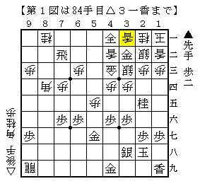
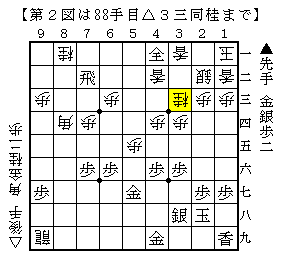
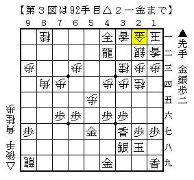

# [居飛穴]藤井になれず１８  

前回投稿の将棋の終盤戦。  
悪かった将棋だが勝負手が通り、ここでは既に逆転しつつある。  

  

ここから▲３三桂成△同金となった局面が一つの山場。  
本線は当然▲２二金△同玉▲４二成銀だが、瞬間詰めろでない。  

そこで実戦は▲３三金と取った。  
△同銀に▲３一成銀と進めば本線と比べより受けにくい１手スキになるという読みだが、  
△同桂と取られてどうしようもなくなった。  

  

穴熊に疎い筆者でもさすがに▲４二飛成に感触の悪さを覚えた。  
△２四桂▲３七香△２一金と進んでみると果てしなく後手玉が遠い。  

  

やはり本線通りに進めるしか無かったようだ。  
とはいえこれもどこかで６二に合駒をされて攻め切るのが容易でなく、  
△２四桂・△２五桂といった手には受けに回らないといけない。  

逆転するのは本当に大変なことだ。  

ところで最初の図から▲３三成桂に△同桂と取る手もあるとBona先生に指摘された。  
▲３一成銀△同銀▲同金には△３七角▲同玉△４五桂打！  

  

・・・いやー、そうっすか。。。  
