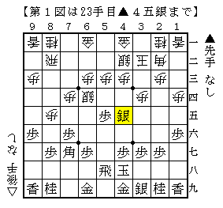
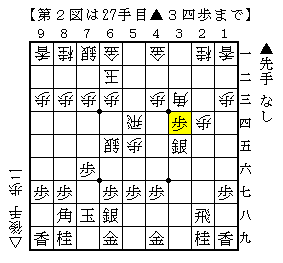
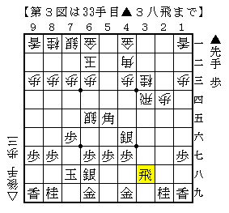

# [中飛車]挑戦か無謀か  

朝日新聞でA級▲久保△佐藤康の観戦記が掲載されている。  
（asahi.comでも無料会員登録すれば１日３記事まで閲覧可能だ）  

この将棋は例の△５四歩ばかりがクローズアップされているが、  
どうしてもそこに至るまでの振り飛車の駒組みに目が行ってしまう。  

  

ここで▲３八玉と△５二金右の交換があれば  
△６五銀でも△７五歩▲同歩△同銀でも▲５四歩で捌ける。  

それ故に居飛車側は△５二金右を省略したという経緯があり  
対する振り飛車側は▲６六銀型で受けるのが主流となった。  

この▲４八玉型は▲６六銀型が主流になる前に久保九段が試みたことのある手だが  
さすがに誰も追随することなく、実戦例も筆者の知る限り１局だけだ。  

第17回銀河戦▲深浦△久保では先後逆・端歩が入っていない局面で  
▲２四歩△同歩▲３五歩△同歩▲同銀△５四飛▲３四歩  

  

△４二角▲４六銀△３四飛▲５五角△３三桂▲３八飛  

  

と進んだ。  
この飛車ぶつけの味がよく実戦は△３六歩と受けたが、これでは振り飛車が良い道理がない。  
数年前に将棋世界誌に掲載された三浦八段による講座でも「これにて居飛車良し」  

ただでさえ流れ弾に当たる予感しかしない上に居飛車良しと断じられたものなら  
普通は諦めて別の鉱脈を探そうものだが、久保九段には何かまだ研究があったのだろうか。  
それがどのようなものか見てみたかった気もするが。。。  
