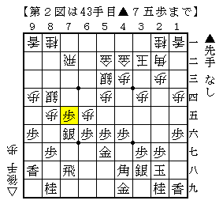
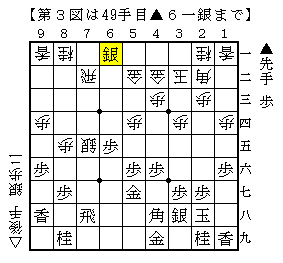
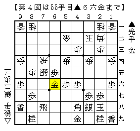
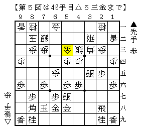

# [棒銀]そろそろ棒銀の話をしよう４  

後手四間飛車対先手棒銀は△６五歩型を中心に回っているが、  
先手四間飛車対後手棒銀だと若干事情が異なってくる。  

▲６七金型でも▲３六歩が入っている分振り飛車がやれるとの話もあるが  
今回は少し前から気になっていた▲５七金型を採用。  

  

△７五歩▲５九角△７二飛▲４八角△７六歩▲同銀△６五歩▲７五歩  

  

▲５七金の先行投資が生きてこの歩が打てる。  
実戦は以下  

  

こうなって  

  

作ったような手順で圧勝。  

△６五歩型は軽すぎると感じる筆者にとってこのような指し口は好みだが、  
後手番ではなかなか使えないのが惜しい。  

ところで筆者は最近このような棒銀対策をされた。  

  

どう考えたって▲２四歩で居飛車が良いはずだが  
実戦は何故か▲３四歩△４二角▲３八飛から半持久戦を選択してしまった。  
△６五歩が伸び過ぎであるような感じがしたのでそれでも悪くないと思ったが  
上手く指されて悪くしてしまった。  

▲２四歩だと何があったのだろうか。。。  
