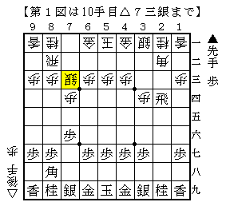
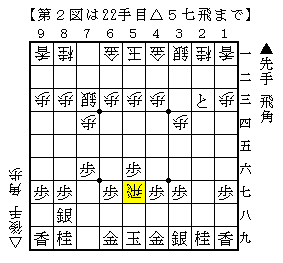
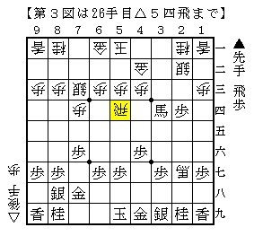
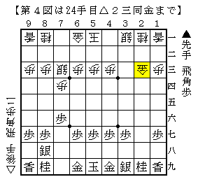

# [その他]都成流の謎  

今月号の将棋世界に「都成流」なる作戦が紹介されていた。  
それを見て衝撃を受けたのは筆者だけではあるまい。  

初手から  
▲７六歩△３四歩▲２六歩△７四歩▲２五歩△６二銀▲２四歩△同歩▲同飛△７三銀  

  

この図を鈴木八段は「新定跡、先手ハマり」、中村六段は「ほぼ互角」としているのだ。  
（ただし「少なくともハマりというほどでもない、後手もそれなりに大変」との情報もあり）  

しかし載っていたのはここまで。  
少なくとも自力で１）▲２三飛成と２）▲２八飛の２つを潰す必要がある。  

・・・あるのだが、筆者の棋力ではほぼ一月考えても答えが出て来なかった。  
ということで現時点までに考えた内容を記しておく。  

１）▲２三飛成  
恐らく△８八角成▲同銀△２二飛▲２四歩まで進む。  

Ａ）△１二角  
大人しく収めるのであればこうだが、▲２二龍△同銀▲３八金のあと後手に手段があるか。  
▲１六歩～▲１五歩など先手の指し手が多いように見え、後手を持つ気にはなれない。  

Ｂ）△４五角  
対して▲５六角と▲７八金が考えられるが、  
前者は△５六同角▲同歩△２三飛▲同歩成△５七飛。  

  

先手が歩切れなのでいい勝負といったところか。  

後者は▲２二龍△同銀にどうするのか難しい。  
▲３八金なら△２六歩と垂らして攻め切れるか難しい。  
▲２三角なら△４二金▲４六歩△２七角成▲３四角成△５四飛。  

  

Bona先生の受け売りだが、これは難しいながら後手まずまずかもしれない。  

また▲２二龍に代えて▲４六歩△２七角成▲３四龍という順もあるかもしれない。  
一目前述の順より劣りそうだが、これでも形勢不明だと思う。  

Ｃ）△３二金  
▲３四龍に△３三金▲３六龍△２四飛▲２八歩は龍が残り後手不満。  
そこで△１二角だが▲２三角と叩き込まれた時が難しい。  

△３三金は▲１二角成△同香▲２三歩成△同飛▲同龍△同金▲１一飛  
と傷を作って先手がやれそう。  

よって△同角か△同飛だが、どちらにせよ２三の地点で飛車角総精算となりそうだ。  

  

以下▲４五角△４一角や▲７五歩が考えられる。  
形勢自体はまだまだ難しそうだが、屈服させている分先手持ちという声が多くなりそうだ。  

２）▲２八飛  
今度は角交換～△２二飛だけでなく△２二銀もありそうだ。  
ただ前者は▲２四歩と垂らされて、後者は▲７八金と先受けされてどうか。  
少なくとも▲２三飛成の変化よりも手が広く大変である。  

筆者が考えたのは大体ここまで。  
早いうちに何らかの媒体で正解を教えて頂きたいところだ。  
