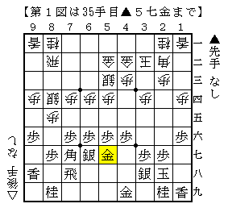

*p2*[棒銀]そろそろ棒銀の話をしよう５  

シリーズ前回の補足をしたい。  

  

「急戦！振り飛車破り　（１）徹底棒銀」に同一局面が掲載されていた。  

△７五歩▲５九角△７二飛▲４八角△６五歩には  
▲７七桂△７六歩▲６五桂△７七歩成▲７三歩△６七と▲７二歩成  
と進めてどうかとコメント欄で述べたが、驚いたことに全く同じ手順が掲載されている。  

ただし形勢判断は「難解な勝負」とあり、そこは筆者の見立てとは違っていた。  

もう一つ筆者の実戦から。  
超強豪氏とのネット上１０秒将棋。  

  

先後の違いがあり△６四歩が入っていないが、それ以外は同一局面。  
次の手は微塵も読んでいないし考えもしたことがなかった。  

  

見た瞬間仰け反った。  
以下成△同銀▲３七桂  

  

△２九飛▲２二飛△３一歩▲３五銀  

  

こうなると差がついてしまっている。  

手順中△３七同桂成は△同桂不成～△２九桂成、  
△３二同銀では飛車を下ろして攻め合った方がまだしもだったかもしれない。  

ということで▲７七桂とするのは結構大変な部分もある、と認識を改めた次第だ。  

（20130804追記）  
「四間飛車の急所３」を見せてもらう機会を得た。  
▲３七同飛△３七同桂不成▲３二と△２九桂成が正解で、  
数手後に筆者の全く気付かなかった秘手があり後手良しとなっている。  

やはり確認できる文献ぐらいは当たっておかないと話にならなかった。  

# [その他]都成流の謎２  
前回都成流が本当に成立するか否かの疑問について記したが、  
もう一つ筆者には疑問がある。  

どうして４手目△７四歩なのか、という点。  
４手目△６二銀としても▲２五歩であれば結局△７四歩で合流するので  
△６二銀の方が手広い意味があり、先手の形を制限している意味があると思うのだ。  

例えば▲７六歩△３四歩▲２六歩△６二銀に▲７八金なら△２二角成がある。  

  

これなら早繰り銀はやりにくく棒銀も出来ないので相腰掛け銀にほぼ限定されている。  
（ついでに筋違い角もない）  

▲５八金右でもやはり△２二角成でどうか。  
▲７八金ほど形を決めていないものの、これもあまり得だとは言えないだろう。  

▲６六歩には△３二銀とすれば一応矢倉に組むことが出来る。  

  

無理矢理矢倉と比べると△８五歩と決めていない分得をしているが、  
それがどれだけ具体的に得なのかは難しい。  

また矢倉にせず右四間という選択肢もあるが、筆者は採用しない。  

４手目△７四歩と違う面があるとすればすぐに△７二飛～△７五歩と仕掛ける場合だが、  
筆者には今のところそれがどういう局面なのか分かっていない。  
△７三銀～△６四銀の数手が余分になることなんてあるのだろうか。。。  

また▲２四歩以下の受け方次第では△７四歩～△７三銀ではなく  
△６四歩～△６三銀などの駒組みが可能になるというケースも出てくるかもしれない。  
あり得ないとは思うが、もしそうなれば非常に面白いのではと思うのである。  
