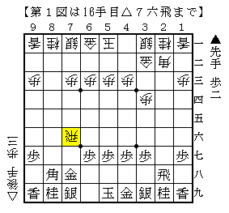

# [横歩取り]一発の力  

[http://www.youtube.com/watch?v=grI7fGkOZYM:movie]  

ご無沙汰しております。  
近々大きな大会に出場するにあたり、横歩取りを組み立て直す作業に没頭しておりました。  
現状完成には程遠く本番に間に合わないことも懸念されるが・・・何とかしたい。  

最近２４指した将棋より。後手が筆者。  

  

珍しく後手が横歩を取る将棋に。  
弊ブログでも以前やったような。。  

  

おさらいすると  
１）直前に▲８三角とするのは難しいもののやや無理気味  
２）打たない場合は玉形が中住まいに限定されないので後手まずまず  
というのが一応の結論。  

  

６筋の歩を伸ばすことが出来まずまずの組みあがり。  
対して▲２五飛とこの歩を狙いに来たがこれは疑問。  
放っておいても突き捨てる歩なのに追いかける必要はなかった気がする。  

  

更に進んで上図。  
先手は指す手がないので仕方なく仕掛けたという感じ。  

  

しかし普通に応対されてこうなるのであればあまり上手く行っていない。  

  

一丁上がり。  
珍しく上手く指せました。  

対局開始時点で100以上R差のある相手だったが、  
それぐらいの差であれば横歩取りなら一発入ることも珍しくない。  

勿論本番で当たる相手はそれでは済まされないレベルの格上だが、  
一発の力を信じて戦えば何かが起きるかもしれない。  
負けるにしても冷や汗をかいてもらうぐらいはしたいところだ。  
