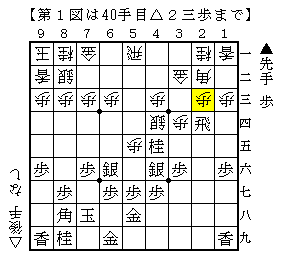
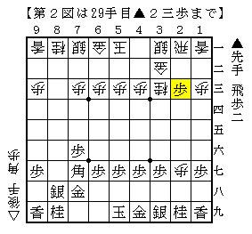
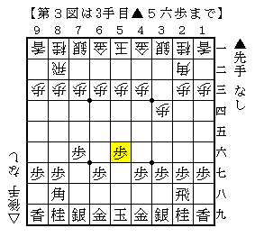
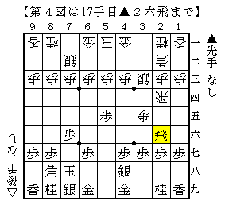

*hamachiya3000*[将棋生活]気合とハッタリも一度は通る  

こんにちはこんにちは！！  
升田幸三杯というすごく大きな大会に行ってきました！  

体育館全部、ステージまで使って将棋を指している光景って壮観…  
大阪の阪田三吉杯の写真を見たことがあるけど、実際にその場に立つと迫力が全然違いました！  

ちなみにぼくの成績は○●●●○○の３－３。  
４勝したら三次特産のピオーネがもらえるんだけど、３局目の大逆転負けが痛かった＞＜  

ぼくって天邪鬼だから、相手が必死になって暴れてきたら攻め駒全部取ってニコニコするんだけど、  
「えーいもうどうにでもなれ！煮ようが焼こうが好きに殺せ！」  
って言われちゃうとどうしていいのか分からなくなっちゃう＞＜  

そうやって今まで金星をたくさん逃してきたんだけど、  
そんな話してもつまんないのでいくつか印象に残った局面紹介します！  

  

ゴキゲン中飛車に▲３七銀急戦をやってみました。  
ここで▲３四飛と頑張ってみたけど、どう見ても無理筋＞＜  
△２三歩には飛車を引いて、離れ駒が多い場合だけ横歩を取ると覚えておきましょう。  

  

横歩取りで△３三角に▲同飛成、久し振りにやられました。  
▲３八金△２八角▲１八飛が本に書いてある手だけどここで変化。  
実戦はすぐに取ったけど、狙いの▲８四飛を先受けする△８二歩が良かったかも。  

  

これも久し振りにやられました＞＜  
[http://www.geocities.jp/syoginosato//contents436.html:title=ここ]にあるような指し方は以前ばっちり対策したんだけど、  
相手がすごく強い人だったので、単純に８筋詰められるのが嫌でヒヨっちゃいました＞＜  

  

今回一番びっくりした局面。  
とりあえず受けてもらって△７四歩～△７三銀としようと思ってたらなにこれ＞＜  
▲５四歩と仕掛ける権利を一方的に持たれて既に困っています。  

（20130904追記）  
よくよく見ると  
△２六同飛▲同歩△２七飛▲３九金△２六飛成▲５四歩△７六龍  
で指せそうですね…  

▲７七角は△４二銀でどうしようもなくなるので▲６八玉とするしかないですが、  
△５四歩▲５三飛△５二金左▲５四飛成△４四銀で、次に△３三角と立て直せば十分っぽい。  

この後もずっと悪いまま終盤になったんだけど、  
最後にハッタリかましたらどういうわけか逆転して勝っちゃいました＞＜  
一か八かでも踏み込んでみるのって大事だね！  

ところでなんで[http://d.hatena.ne.jp/Hamachiya2/:title=はまちちゃん]の真似してるかって？  
特に理由はないんだけど、それぐらい悔しかったということにしておいてください＞＜  
ピオーネ…  
