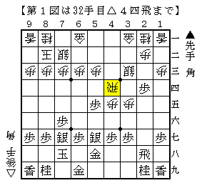
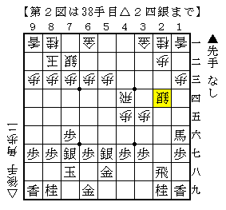
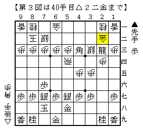

# [角交換振り飛車]実戦で考える  

元々大した研究などしていなかった筆者だが  
大きな大会に出た反動で燃え尽きたのか、ここのところまるで考える気力が湧かない。  
そんなわけで筆者の実戦でお茶を濁させてもらうことにした。  

  

数手前まで銀河戦▲長岡△藤井と同一の将棋。  
直前の▲５五歩に代えて▲７五歩が実戦の進行だが、対する△３二角が妙手で居飛車が芳しくない。  
▲５五歩は長岡本で解説されていた代替案だが、書いてあるのはそこまでである。  
一度実戦で考えてみたかった局面だ。  

いざ△４四飛と浮かれてみると案外困った。  
そもそも▲７五歩は△４四飛を牽制している手のはずだが、  
▲５五歩ではむしろ牽制できていないような感じがする。  

１）▲５四歩△同飛▲４三角△４四飛▲１六角成△２四銀  

  

２歩得対馬で難しいが、あまり居飛車を持って自信はない。  
振り飛車側は△２三歩・△３二金・△３三銀など指したい手が多いが、  
居飛車側は次の手すら見えない状況だ。  

２）▲２三歩成△同歩▲５四歩△同飛▲２三飛成△２四歩▲４三角△２二金▲同龍△同銀  

  

実戦の進行だがこれもどうだったか。  
以下▲５四角成△同歩▲５三歩と嫌味をつけたが、△４二飛が冷静な対処で息切れしてしまった。  
▲５四角成に代えて▲２一角成と桂を取る手も考えられるが、△３三角が感想戦で示された好手。  
飛車を下ろして△７七角成と切り飛ばされる筋を見せられてはまるで自信がない。  

元々△３一金がある状況下で▲２四歩と突っ込むのは無理だと思っていたが、  
今回の実戦でそれが実感として得られたのは一つの収穫であった。  

居飛車側としては[http://ameblo.jp/thousandays/entry-11410759991.html:title=あさげさんの記事]にあるように△３三銀を見て▲２五歩とするか、  
村田本になるように▲７八玉よりも▲５八金右を優先させる指し方が無難だろう。  

（20131107追記）  
11/5竜王戦▲佐々木勇△千葉にて美濃囲いまで囲ってから△８八角成とする手法が現れた。  
▲５八金右を優先させる指し方では△３三銀保留を咎めることは難しいと見られ、  
△３三銀と▲２五歩がワンセットの指し手であることがはっきりした。  
