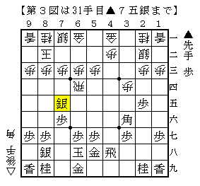

# [棋書]余談  

前回投稿した記事の最後に村田本掲載の指し方について触れたが、  
村田本掲載手順にはちょっとした穴があるのでこの機会に触れておきたい。  

  

普通は△３三銀と▲７八玉の交換が入っている局面。  
▲４六歩△４四歩▲４七銀△４五歩▲同歩△同飛▲１八角  
と進み、△６五飛には下図以下次のように進めるとある。  

  

>>  
▲７七銀△８五飛▲８六銀△８四飛▲７五銀△９四飛▲９六歩という要領で飛車を圧迫できる。  
<<  
さすがにここまで書けばお分かりだろう。  
▲７八玉が入っていないので▲７五銀には△８七飛成とされて終了形だ。  

よって正確に咎めるのであれば△４五歩▲同歩△同飛には▲３六角とこちらから打ち、  
△６五飛▲５六銀△６四飛▲５五銀△６五飛▲６六銀△６四飛▲４八飛△４二歩▲７五銀  

  

と一度銀を繰り替えておき、△６五飛▲７七桂と飛車を追って▲６三角成とするべきだろう。  

途中▲６六銀△６四飛のタイミング、もしくはそれ以前に▲４八飛△４二歩の交換を入れておくのが  
村田本手順にもある一つのポイントで、これを入れないと▲７五銀に△４四飛と逃げられて紛れてしまう。  
（尤も▲６三角成が金取りなので▲２七馬と引いて受かってはいる）  

同様にこの場合は▲３六角とこちらに打たないと▲７七桂に△２五飛と高飛びされてしまう。  
△３五歩といじめられる手が見えているだけに１八から打ちたくなるが、  
どうやらこの形は例外であるようだ。  

村田本は前著でも図面等に誤植があり「アレッ、」と思ったものの  
内容の素晴らしさ故まるで気にならなかったということがあった。  
今回も枝葉の些細な部分でボロが出てしまったが、  
依然として素晴らしい定跡書であるという点は何ら変わりないことを強調しておきたい。  
