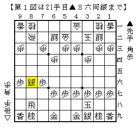

# [角交換四間]されど端歩  

序盤早々に端歩を突かれることがある。  

初期のゴキゲン中飛車は▲７六歩△３四歩▲１六歩という出だしだったが  
如何にも飛車を振りますという手なので、個人的にはここで△８四歩とは突きにくい。  
現状相振り含みで△１四歩としているが、もちろん△８四歩でも悪くなるわけではない。  
ただ居飛穴を指せないのはこういうところで選択肢を狭めて損をしている。  

▲１六歩ではなく逆側の▲９六歩と突かれることもある。  
プロでは振り飛車党同士の対局で時折現れる手だが、  
居飛車党としては「これなら△８四歩としてもいいかな」と思うことが多い。  
振り飛車にしてくる相手がほとんどだから。  

▲６六歩からノーマル振り飛車にされた場合はあまりこの手は問題にならない。  
四間飛車なら棒銀に出た際にほとんど影響はなく、  
三間飛車も△９五桂と打てないことにさえ留意すれば仕掛けることは十分可能。  
もちろんここでも持久戦を選ぶことができればそれに越したことはない。  

先日２４で指していると▲９六歩△８四歩に▲６八飛とされた。  
その刹那次の局面が脳裏をよぎる。  

  

あれ、結構嫌じゃないかこれ。  
これはこれで受け方があるかもしれないが、実戦その場で正解を出すのは大変そう、  
△８五歩と決めずに▲９八角と打たせる展開にするのが現実的かもしれない、  
などなど序盤早々から考えたものだが、結局図の局面にはならなかった。  
しかしたかが端歩と言えどもどこかで効いてくるものだなぁ。  

こういう展開が嫌なのであれば▲９六歩に△１四歩と突き返すのも一策だが、  
将棋世界双龍戦▲清水上△永瀬のように▲９五歩とされたりすると最早謎の領域だ。  
横歩を取らずに突く端歩など、序盤早々の端歩はよく分からないことが多すぎる。  
