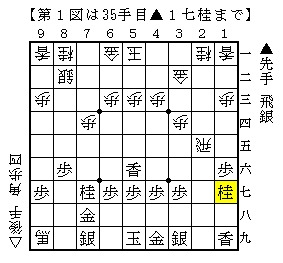

# [横歩取り]されど端歩２  

横歩を取らずに端歩を突くというのもよくある序盤の端歩。  
対して飛車を引けば穏やかではあるが、それで幸せになれるかというと微妙なところ。  
あくまで横歩を取るという姿勢を貫くのが理想ではある。  

▲１六歩に横歩を取ると先後逆の△４五角戦法が予想される。  

  

ハメ手というより最早定跡と言ってもいいのではないかとすら思える図。  
これを回避するのであれば数手前の△７四香までに変化すべき。  
ショパン先生のブログにある△２二飛が有力かと思われる。  

横歩取り 後手△４五角戦法 △３三桂に▲８八飛  
http://ameblo.jp/shogi-strategy/entry-11065451281.html  

相横歩にされた場合はすぐに何かしら違いが出るわけではない（はず）。  
大決戦になった際には詰む詰まないのところで影響することが考えられるので  
△３三桂や△３三銀から飛車交換をしない指し方を選びたい。  
そうなれば▲１六歩が傷になる展開になりやすい。  
