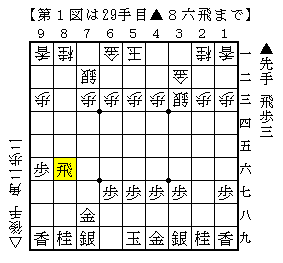
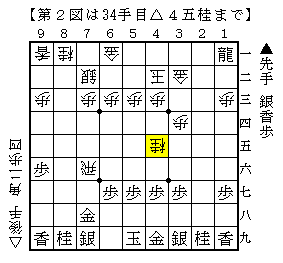
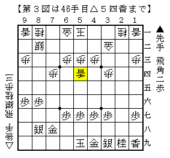

# [横歩取り]されど端歩３  

横歩を取らずに▲９六歩は▲１六歩よりも△９五角を消している分含みが広い。  
先後逆△３八歩～△４四角戦法（以下▲６六角戦法）と相横歩がその代表例。  

▲６六角戦法に普通に指すと下図のようになる。  

  

▲９六歩がなければここから△９五角▲８七歩△３六歩となり後手が良くなるが、  
実際は見ての通り△９五角と打てないので酷い。  

またこの図に至るまでにも△３三歩に▲３六飛とせずに▲８四飛と回る手もある。  
以下△８三歩▲８五飛△７一金▲７五歩がものの本に書いてある手順だが、  
飛車を手持ちにすると▲９五歩～▲９四歩が早い。  
形勢そのものは微差だと思われるが、一方的に気を遣い続ける展開なので後手を持ちたくない。  

よって将棋世界飯島講座や北島本に掲載されている通り  
▲６六角に△３三角と合わせる順が最善だと思われるが、  
飯島講座で検討が打ち切られている下図から後手が勝ち切るのはまだ容易ではないと思う。  

  

なお冒頭で触れなかったが先後逆△４五角戦法でも注意しないといけない筋がある。  
△７四香▲同角とされた順で△９五角と打つ筋が所々に現れるからだ。  
やはりこの場合も前回同様△２二飛と打つ指し方で避ける方が賢明なのかもしれない。  

ところで前回触れるのを忘れていたのだが、  
ある棋書で紹介されている下図は本当に後手が良いのだろうか？  

  

筆者にはあまりそうには見えないのだが。。。  
