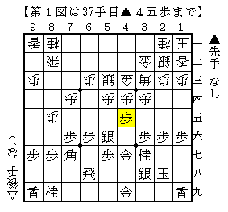

# [穴熊日記]９月２９日  

※穴熊スーパーど素人ですが、下手糞なりにちょっとずつ指してみることにしました。  

・先手四間飛車に居飛穴  

  

図から△７五歩▲同歩△７二飛としたが  
▲４四歩△同銀▲６五歩△４二角▲４五銀で終了形。  

図では△５一角と当たりを避けておくのが当然の一手。  
△７三角と転回すれば▲４五歩と伸びた形が逆に嫌味となる。  
恐らくこういうことは基本中の基本なのだろうが。。。  
