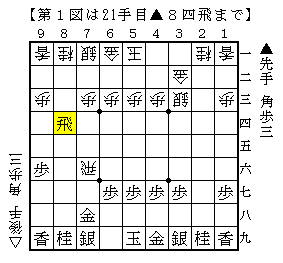
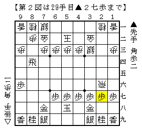
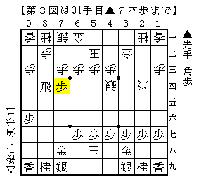
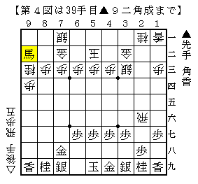

# [横歩取り]されど端歩４  

▲９六歩が入った相横歩も何かと厄介な戦型である。  
※そもそも筆者は相横歩があまり好きではない。  

  

このように飛車を回ることが出来るのが大きな主張。  
以下の戦いについては下記の記事群がかなり詳しいのでそちらに譲りたい。  

はんどろやノート - 「９六歩型相横歩」の研究（１）～（４）  
http://blog.goo.ne.jp/handoroya/e/84cec56c9a0bf7a03046087ef2439c78  
http://blog.goo.ne.jp/handoroya/e/974d80f2cfd4b5d61d98a77925b305e3  
http://blog.goo.ne.jp/handoroya/e/9b05f4a60aa7e8ea3de37b8059cef782  
http://blog.goo.ne.jp/handoroya/e/99ea8d54211808dd6f7a7e5aeb99f635  

後手としては安定して△２四飛型を得られれば不満がないようである。  

ところで上記の記事の実戦では△８二歩に▲８八飛と引いている将棋が多かったが、  
▲５八玉△２六飛▲２八歩△５二玉▲３八金△７二金▲２七歩  
とあくまで△２四飛型を拒否する指し方をするとどうするのだろうか。  

  

△２二飛▲６八銀△８三歩▲８六飛という展開はそのままでは飛車の働きが今一つで、  
かといって再び△２四飛と浮くのは悔しいものがある。  
▲７七銀なら同型から▲９六歩の一手に限定したという意味合いを見出すことも出来なくはないが、  
飛車を引くならダイレクトに△２四飛と引きたいものだ。  

先ほどの図に至る途中▲３八金に△７二金とせず△４四銀とするのも考えられる。  
今度は▲２七歩に△２四飛と引くことが出来るのだが、その瞬間に▲７四歩が気になる一手。  

  

△７二金には▲４六角～▲７三歩成が狙い筋。  
△７三同金は▲同角成△同桂▲７二歩があり収拾がつかないように見える。  
かといって△７三同桂ともやりにくいので、△３三銀か△５五銀と受けるのが正着だろうか。  
現段階では難解ということにしておきたい。  

上記の展開とは別に▲８八飛△２六飛▲２八歩△５二玉▲９五歩△７二金  
▲９四歩△同歩▲９二歩△同歩▲９三歩△同桂▲８一角△８三角▲同飛成△同歩▲９二角成  
という順を掲載している書籍もある。  

  

これには△８五桂と逃げておいてどうか。  
香損だが２筋３筋方面が広く余している気もするものの、局面自体は難しい。  
