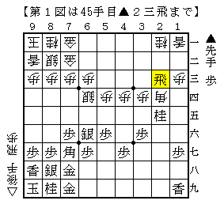
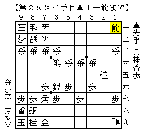

# [穴熊日記]１０月１日  

・向かい飛車に居飛穴  

  

こちらだけ桂を拾うことができ部分的には居飛車成功の図だが、  
手順に角を切られるのがどうにも痛い気がする。  
悪くはないと思いたいが、実際のところ形勢がどうなのかは全く分からない。  

  

ここで先着一名様とばかりに△８四香ならどうだったか。  
▲８六歩～▲８七香～▲８五歩の予定だったが、▲８六歩の瞬間があまりに怖すぎる。  
▲６八角としておき場合によっては▲１三角成とするのが大人の対応か。  

実戦は△６五香と打って銀を取りにきたが、これは筆者でもはっきり悪手と分かる。  
貰った香も注ぎ込み８筋に桂香香の３段ビームが炸裂して快勝。  
こういう展開になればド素人にも分かりやすい。  
