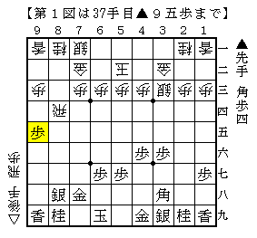
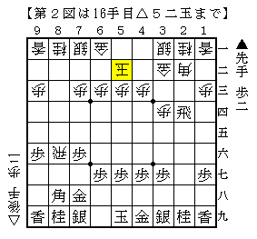

# [横歩取り]されど端歩５  

前回は▲９六歩型を活かした▲８四飛型を扱ったが、  
▲３六飛と通常の相横歩に近い形に持っていくのはどうか。  

△同飛▲同歩△６四角の決戦策は最終盤に玉が広い分先手が得をしている可能性があるが  
今のところすぐに違いの現れる局面は発見できておらず、今後の検討課題である。  

また△７四飛と決戦を避けるのは▲２六飛△２三歩▲６九玉とする北島本の順が気になる。  
△３六歩▲同飛△２七角▲３八角△３六角成▲同歩となった際に  
▲９六歩が入っているので９筋攻めが１手早い。  

  

これはこれで一局かと思われるが、▲９六歩の一手が活きているのが癪に障る。  

よってお互い駒組みを進めてどうかというところだが  
後手番の割にはまずまずと言える一方、これといった主張に欠けるという感じもする。  
▲９六歩の一手があまり生きない展開ではあるのだが、▲８八歩を省略できたのも大きい。  

なお決戦を避ける意味合いで▲７七銀ではなく▲７七桂とするのは▲８四飛△８二歩に▲８三歩以下  
68期A級▲佐藤康△井上の感想戦の順があり危険。  
（実戦は▲９七歩▲５八玉型だが影響はなさそう）  

また▲８八飛△２六飛▲２八歩△５二玉▲９五歩以下前回第４図同様に進めた場合でも  
△８五桂▲２七香△８六飛▲２二香成となってはまずい。  

最後に「長岡研究ノート　相居飛車編」の発売を控えた長岡五段の実戦を紹介したい。  
（目次を見る限りかなり期待できそうだ！）  
手順は違うものの▲９六歩となった局面で長岡四段（当時）の指し手は△５二玉！  

  

佐藤流▲５八玉の応用で、ある程度穏やかに指すのであればこれも有力かもしれない。  
以下▲６九玉△７六飛▲７七角に  
１）△７四飛▲８八銀△２三歩▲２五飛△８六飛  
２）△７四歩▲６八銀△７三桂  
が一例。  

前者は△７二金～△６二銀とすると横歩を取らずに▲２八飛と引いた将棋同様▲９六歩が生きてくるので  
△７二銀～△７三銀や角交換～△３三桂～△３五歩という将棋を選ぶことになりそう。  
後者の青野流も有力で、▲９六歩の一手が生きにくい上に▲６九玉型に限定されている。  
むしろこちらの方が本筋かもしれない。  

なお実戦は▲２二角成△同銀▲７七角となり乱戦に。  
△８九飛成▲２二角成に△４二角がありやや後手が指せると思うが、これも難しいといえば難しい。  
