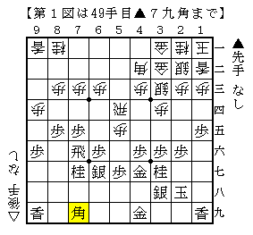
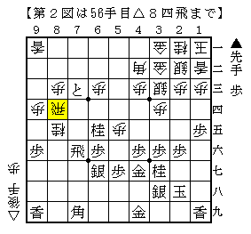
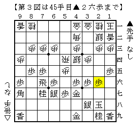

# [穴熊日記]１０月７日  

・石田流に中飛車左穴熊  
元は３手目▲７五歩には△１四歩を試しているが、▲１六歩と受けられるとはっきりしない。  
オプションとしてこういう指し方も出来れば心強い。  

  

これでもかと固めて態勢は十分、後は仕掛けるだけ。  
とはいえ筆者にとってはそこが大きな課題でもある。  

当然ここは△８四歩と動いていくところなのだが、  
筆者の指し手は△９三桂。貧乏性が顔を出してしまった。  

  

ここで▲６三となら自信のない展開。  
実戦は▲８八歩と受けたので△７五歩～△６四歩が入り急に良くなった。  
以下端を攻められヒヤリとしたものの、堅さに物を言わせ制勝。  

ところで本譜は駒組み段階で手堅く△３二金～△１二香としたが、  
普通に△１二香～△２二銀を先に指して△３一金△４一金型にすべきだったか。  

  

これだと端を気にしてわざわざ△３三銀引とする必要もなく  
安心して△７四歩ぐらいから駒をぶつけることができ、△３五歩の筋もやりやすい。  
何より△３二金上を入れるかどうかという選択肢が残っている。  

闇雲に固めるのではなく、相対的な堅さの差を常に気にしておきたい。  
