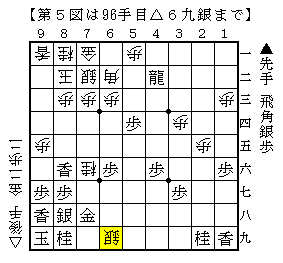

# [穴熊日記]１０月８日  

・三間飛車に居飛穴  
筆者がある意味仕方なく穴熊を勉強しているのはノーマル三間飛車、  
特に先手三間飛車対策のためと言ってしまっても過言ではない。  
しかし筆者にとってかなりの鬼門でもある。  

  

長岡本にもあった小倉流。  
ここから▲５九銀～▲６八銀とし、△５二飛には△６五銀を消して▲６六歩とある。  
しかし先に△６五銀とされた時の対処が分からなかった。  
実戦は焦って▲５六歩と突っかけてしまう。  

  

数手後の局面。  
既に相当自信がない、というよりも形勢自体も悪そう。  
こうなるのなら▲５六歩では▲６六歩だったか。  

  

相手の見落としもあってかなり追い上げた終盤戦。  
一目は▲３五同龍だが、△同歩と取られた次の手が難しい。  
▲４四角と打ちたいが△５四銀と払われて続きそうな気がしない。  

実戦は以下  
▲４二龍△６六銀▲同歩△７六桂▲４六歩△５八と▲５三銀△６九と▲６二銀不成△同角  

  

▲６九金△同龍▲７九金打△７八龍▲同金△６九銀  

  

となり受けが利かなくなった。  
手順中△６六銀を手抜いて何かしら攻めるのがまだしもだが、  
５三に角金を叩き込んだところで精算されて駄目だと思った。  

追い上げたつもりでいた第３図の局面もやはり悪かったのだろうか。  
