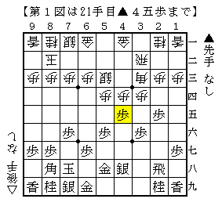
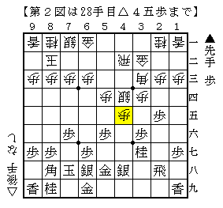
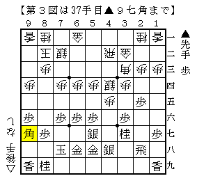

# [三間飛車]充実の実戦群  

充実した内容の実戦をまとまった数指すことが出来たので、  
今後何度かに分けて紹介したい。  

  

△５三銀型三間飛車に急戦で挑む。  
（あれ、穴熊は？というコメントは受け付けません）  

イメージとしてあったのは70期C2▲西尾△西川と▲吉田△西川の２局。  
即ち図から△４二飛▲３七桂△３二金▲４四歩△同銀▲４六歩として、機を見て▲４五桂と跳ねる順。  

ところがうっかり先に▲６八銀と上がってしまったので△３二金が間に合ってしまった。  
以下図のようになって早くも作戦失敗。  
先手番なのに仕掛ける場所が見当たらない。  

  

実戦は仕方なく対四間飛車中原流の応用で端角から組み立てたが、  
これもあまり幸せになれる構成ではない。  
（尤もこれはこれで力が出やすい展開か）  

振り飛車側に隙ができたので仕掛けてまずまずの展開になったが、  
後に△３一金や△４三金からじっくり駒組みを進められてもあまり良くなかった。  

  

なお実戦はやや良さそうな棋勢が続いたものの、最後に時計が切れて負け。  
