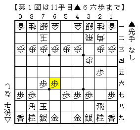
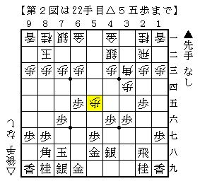
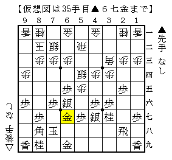

# [４→３]充実の実戦群２  

４→３戦法対策には▲６六歩と止める指し方を筆者は愛用している。  
ただし数手後に▲６五歩と再び角道を通すのがミソ。  
戸辺本にも一応載っているが、70期B2▲先崎△安用寺というモデルケースがある。  

  

角交換～左美濃という展開が居飛車側の理想的な進行。  
どこかで▲６四歩～▲６二歩などが入る。  
振り飛車側から角交換してこない場合も▲５六銀と圧力をかければ  
振り飛車側は角交換するか△４四歩と止めるかしないといけない。  

  

△２二飛と振り直して仕掛けられたことは何度かあったが、  
△５五歩と止められたのはこれが初めて。  
△５三銀～△５四銀～△５二飛・・・  
難しいながら▲６五歩・▲４六歩のバランスが悪いように感じられる。  

  

実戦は△４四角～△３三桂と４五の地点に数を足したので  
▲５六歩△同歩▲同銀と５筋を制圧していきなり良くなった。  
しかし筆者の４→３戦法対策に一石を投じた一局であった。  
