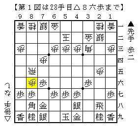
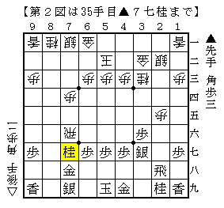
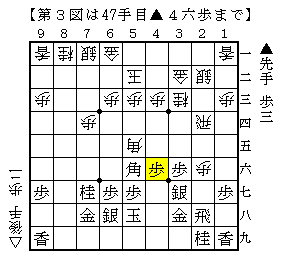
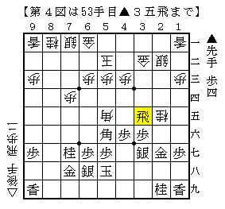

# [横歩取り]充実の実戦群３  

筆者の主力は△８五飛△５二玉型だということは以前触れたかもしれないが、  
敢えて弊ブログでは取り扱わなかったというのも事実。  
主力という位置づけの割に碌に掘り下げていないというのがその理由である。  

  

筆者がこの戦型を指すにあたって３局のモデル局を強く意識しているが、  
その内の１つがNHK杯▲船江△村山。  
▲３六歩には△２五歩と押さえてしまい、とにかく軽く軽く指す。  
それが△５二玉型と相性の良い指し方だと思う。  

  

部分的にはかなり気持ちよく指しているが、ここからが正念場。  
△８六飛～△７五歩をはじめ手が広い局面。  
実戦は△２六歩～△７五飛～△２五飛としたが、最善かどうかは微妙。  
攻め甲斐のある場所だが相手の厚い部分でもある。  

  

ここで△２五桂と△２七歩成で迷った。  
△２五桂は▲２六飛△３七桂成▲２四飛△３八成桂で二枚換えだが、  
７筋方面が広いので先手玉を捕まえるのが容易ではない。  
よって△２七歩成▲同金の交換を入れて△２五桂のつもりが、  
実戦は▲２七同飛とされてしまった。  

  

こうなってみると容易に駒損を回復できない上に５六の角が非常によく利いている。  
以下頑張ってみるものの短手数で負け。  

そもそもの仕掛けが軽すぎたのかもしれない。  
即ち最初の図でいきなり仕掛けずに、△７三桂としてから△８六歩が修正案の一つ。  
第２図で手が難しいようであればそういうところまで遡らなければならない。  
