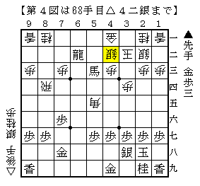

# [角交換四間]充実の実戦群４  

先日の投稿で先手角交換四間飛車に対抗することの難しさを述べたばかりだが、  
かと言って簡単には妙案を捻り出すことは出来ない。  
以前２～３ほど新しい指し方を試したが、そう簡単に使いこなせる代物ではなかった。  

  

先手角交換四間飛車相手にも△６三銀型に組めることは組める。  
ただしそれを活かすことが出来るかどうかは腕次第。  

次に▲５六銀～▲６五歩と来るのは火を見るより明らか。  
対して△６二飛と大人しく受けておくのが普通かもしれないが、  
△５二金右と上がってしまっているので模様が取りにくいように思えた。  
よって本譜はやらせてみることに。  

  

この角に期待。  
「１００回に１回くらいこういう種の手が妙手になる」という言を見たことがあるが、  
なんとなく今回がその１００回に１回にあたる気がした。  
以下▲４六角△３三角▲７七桂△６五歩▲同銀△６七歩▲同飛△６六歩▲６九飛△５五銀  

  

と予定通り角を殺すコースに突入。  
ただし歩切れになった上に▲７七桂と跳ねられ、形勢自体は微妙だったかもしれない。  
瞬間の気持よさだけで、１００回に１回とまではいかなかったようだ。  

  

更に進んで上図。  
直前の△５五角の味が良く、多少悪くとも頑張れると思っていたが  
ここでの▲６三馬が気が利かないようで絶好手。  
以下頑張ったものの、向こうの玉に手が付かないのでは勝ちようがない。  

先手角交換四間飛車の手強さを改めて実感した一局であった。  

