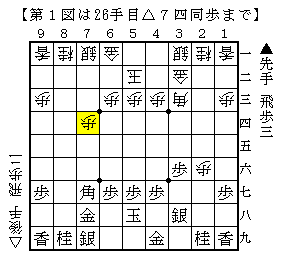
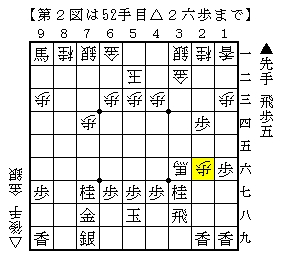
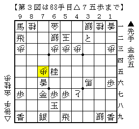

# [横歩取り]充実の実戦群５  

定跡型について調べていると「形勢不明の課題局面」なるものにぶつかることがある。  
雰囲気で「こちらを持ちたい」という筆者なりの意見を出すことも多々あるが、  
やはり実際に指して考えないとリアルな感触は得ることが出来ない。  

ただしある程度の定跡の知識を有し、同じ考えを持つ相手と指さないと  
その局面に至らないという極めて高いハードルが存在する。  
定跡型を指すというのはある意味では両対局者の共同作業であるとも言えるのかもしれない。  

  

横歩取りを指す以上青野流は避けては通れない道。  
しかしこれも分からないことだらけである。  
当初は△４二玉型が本筋だと筆者は考えていたのだが、  
今は考えが変わり△５二玉型を採用することが増えた。  

  

「形勢不明の課題局面」まで到達。  
とは言っても途中数手の手順前後があった。  
たまたま致命傷とはならなかったが、手の意味合いを考えればあり得ないこと。  

そしてここに至るまでに変化されてもよく分からない。  
実際指しているといくつも気になるポイントが現れた。  

  

細い攻めを繋げることは筆者の大きな課題の一つ。  
本譜はこの後もなんとか繋ぎきることができた。  
毎回これぐらい上手くいくといいのだが・・・  

感想戦で指していて気になったポイントを幾つか検討してもらった。  
本譜と比べると若干劣るようだが、それでも結構難しい。  
こうして一度経験しておけば実戦で現れても落ち着いて対処できる。  
ありがたい限りだ。  

以上でこのシリーズを終了としたい。  
H山将棋センターの皆様ありがとうございました。  
