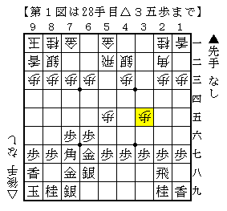
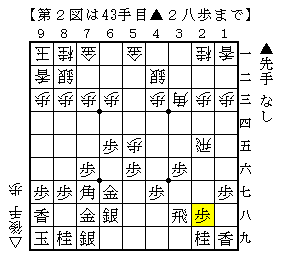
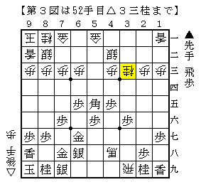
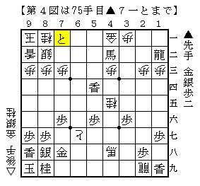

# [穴熊日記]１０月２２日  

・ゴキゲン中飛車相穴熊  
▲７六歩△３四歩▲４八銀とされると案外指し手に迷う。  
筆者の性分から言えば△８四歩としたいところだが、  
先後の差以上の明確な良さを得るのは案外難しいのではないかという気もする。  
ということで△３二飛・△４二飛・△５四歩・△８四歩を気分に応じて使い分けている。  
気分屋にとって一番大事なのはその時々の気分に沿った指し手を選ぶこと。  

  

基本的に筆者は相穴熊は指さない方針だが、  
飛車を振った以上は全く指さないというのも無理な話。  
こういう展開であれば２筋不突はあまり生きてこないのでまだ良しとしたい。  

本譜は▲６八銀右が早いと見て△３五歩。  
JT杯▲久保△広瀬で初めて見たが、考えてみれば極々普通の手でもある。  
それと比べて偏っているので尚更受けにくい気がした。  

  

既に振り飛車十分だが、ここからしっかりと良さをキープしたい。  
実戦は以下  
△４五飛▲４八飛△１五角▲４六歩△４八角成▲４五歩△３九飛▲５五角△３三桂  

  

と進み、まずまずの形勢を維持できた気がする。  
金銀がやや離れているのが気になるが、△４五桂～△５三歩という筋があるのは心強い。  

  

最終盤、ここで△８九龍から追っていって詰む。  
▲７七玉に△６五桂が利くので見た目以上に簡単だ。  
しかし詰みそう、と思ったものの確信が持てず一度△７一銀と手を戻してしまった。  
対して▲５七馬だったので今度こそ詰ませて勝ちになったものの、  
これぐらいは逃さず仕留めておきたいところだ。  
