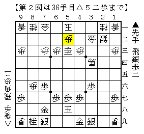
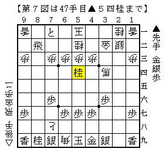

# [横歩取り]容易でない  

棋書の先の変化（長岡研究ノート 相居飛車編）  
http://ameblo.jp/shogi-strategy/entry-11651703888.html  

強い方はこういうところでアンテナが反応するものなのだなあと感心。  
他にも気になったというような事を仰っている方を見かけたので  
反応するのが当然の箇所なのかもしれないが。  

筆者は居飛車を指してこそいるものの振り飛車マインドが幅を占めているタイプなので  
テーマ図を一目見てS木D介先生ばりに「これは先手必勝でしょう」と断言してしまうのだが、  
検討してみると確かに容易でない。  

  

ここから▲８二と・▲４四同飛が考えられるが、  
後者は以下△８三飛▲６五角△４四歩▲８三角成△４五歩▲６五馬△３一金  

  

が一例で自信のない進行だと思われる。  
変化の余地はあるものの、どうにも歩損桂損と駒不足に陥りやすい。  

そこで▲８二と△３四馬▲７一と△同金▲５三桂成△５二歩と進む。  

  

途中▲７一とに代わり▲５三桂不成として▲４一飛と打つのが相横歩でもよく出る筋だが  
上部に逃がす順なので、筆者としては他が駄目だとはっきりしない限りそれは読みから外したい。  
故に本稿では検討の対象外とするが、当然こちらが最善である可能性もかなりある。  

ここで▲５二同と△同玉▲５四飛とすれば馬を抜けるが、  
△５三歩▲３四飛△３三銀▲８四飛△８七歩成▲同飛△８二歩  

  

と屈服されても先手良しとはいえはっきりしない。  
馬を抜いて気持が良いようでも冷静に見れば駒割りは銀桂交換でしかなく、  
将来△３七桂といった手でこじ開けられる可能性が高い。  

更に言えば△５三歩とせずに△４一玉などと頑張って  
将来の△５六歩に期待するような順まであるかもしれない。  
ということで▲５二同成桂は却下。  

次に▲６二銀だが、△６二同金▲７一飛△６一銀▲６二成桂△同玉▲８一飛成△４四馬  

  

でどうか。  
６一の銀が取れそうな形だが、５三に逃げられるので自信無し。  
また▲６二銀△同金▲同成桂△同玉▲８四飛△４四馬▲８一飛成も同様。  

ということで第２図からは▲８二歩としたい。  
以下△５三歩▲８一歩成として△同金には▲８四飛があり、  
今度馬を取れば丸々銀得なのでさすがに先手良し  
・・・と思ったのだが、Bona先生にお伺いを立てたところ△８七歩成という手を指摘された。  

  

▲８七同金は△８四飛としてと金を抜く狙い。  
角銀交換で馬も作られており、長引くと先手が悪い。  
かと言って▲７一と△８七飛成という攻め合いは▲７八銀打に△６六桂があり後手が勝ちそう。  
ということで△８七歩成には▲７一と△７八とと取り合うしかなさそうだ。  

▲７八同銀とすると△４二玉と早逃げされて駄目になるので  
ここは▲８八飛と降ろしておく一手。  

  

対する後手の手が広いようだが、有効な受けは△５二桂の一手だけだと思われる。  
（△５二金は▲６一金、△５二飛は▲同飛成△同玉▲８二飛でヤブヘビなので  
代わる手は△４二飛ぐらいだが、▲８一飛成に△５二飛と再び逃げるのでは辛い）  

△６六桂の筋がなくなったので▲７八銀と手を戻しても良さそうだが、  
△６九角と王手を入れてから△５二桂と手を戻す順も考えられる。  
よって▲５四桂と決めに行ってどうか。  

  

△５四同歩▲５三銀となると受けがないので△４一玉と耐えるぐらいだと思われるが、  
▲６一とが詰めろで入るので先手好調。  
以下△５四歩▲５一と△４二玉▲５二と△３三玉▲３五銀  

  

と進めば難しいながらも先手が良さそう。  
先手玉は最悪▲７八銀と取れば１手は稼げる形だ。  

以上既に大穴の空いているような非常に荒っぽい検討ではあるが、  
「テーマ図以下▲８二と△３四馬▲７一と△同金▲５三桂成△５二歩▲８二歩で先手指せる」  
を現時点での筆者の一応の結論としたい。  

（20131125追記）  
棋書の先の変化（長岡研究ノート 相居飛車編）01(考察編)  
http://ameblo.jp/shogi-strategy/entry-11661127698.html  

やはりと言うべきか、でっかい穴が開いていた。  
