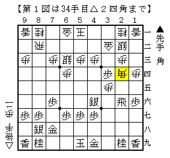
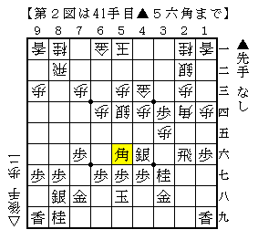
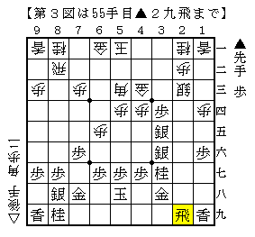
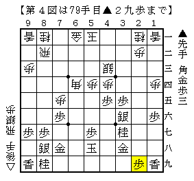

# [相掛かり]逃す  

最近は後手番で相掛かりを指すようにしている。  
先手で相掛かりを指す以上逆も持って経験値を上げるべきだと思ったからだが、  
３手目▲２五歩の対策で面白そうなものを発見できていないという理由もある。  

  

中原流に対しこの角を採用。  
68期B2▲中川△森下など、数は少ないが森下九段が採用している手を真似てみた。  
ただし本家はこのような居玉の状態で角を手放すことはしていない。  
本譜の作戦は少し強情すぎた。  

  

早々に先手が勝負手を放つ。  
直接的には歩を守っているだけなので相手をする必要もなかったのだが、  
やはりどうしても△６五銀という手が気になってしまう。  
あれこれ考えた末にやらせてみることにした。  

  

更に進んで上図。  
直前に▲１四銀と捨てる手を逃したため先手の攻めは失敗に終わっている。  

ただここでの指し手に悩まされた。  
指したいのは△５二金だが飛車の横利きが消えているので  
△３四銀と払っていくような手を選ぶことができない。  

本譜は△７四歩としたが、少し悠長すぎる感じがして感触は良くなかった。  
△５五歩辺りが本手だったか。  

  

本局のハイライト。  
ここから△３七角成▲同金△６六桂▲４七玉と進んだが、  
そこで△４九飛としたのが敗着。  
▲４八金△２九飛成とするようでは明らかにおかしい。  

代えて平凡に△７八桂成と金を取って後手が良かった。  
先手は▲６四角としたいが△４八金として抜くことが出来る。  

２手目△８四歩系の将棋は決めるところでしっかり決めないといけないのだが。。。  
