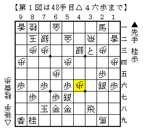
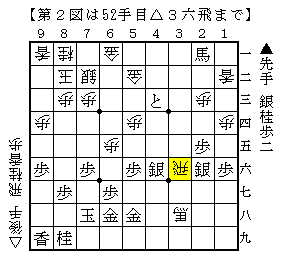
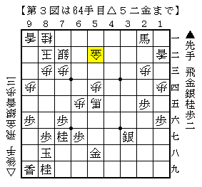
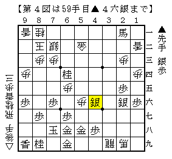
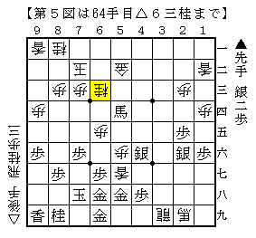

# [棒銀]そろそろ棒銀の話をしよう６  

穴熊日記なるものをしている筆者だが、対振りの本命はやはり急戦。  
棒銀も事あるごとに検討を進めている。  

  

竜王戦▲橋本△阿部隆で指された新手は個人的にかなりのインパクトがあった。  
２六に銀が取り残される進行である上、手そのものがあまりに感触が良すぎるので  
「こんな手が入ってしまうようでは・・・」と思ったぐらいだ。  
しかしこれ以前に変化するのも難しいと思われるので、  
今のところこの手の対策を考えることが多い。  

なお第１図最終手△４六歩に代えて△４六桂は▲５九金と引いてなんともない。  
▲３八飛は馬で取る駒であって、更に桂で利きを足しても効果が無い。  

取りに取りを重ねる～某女流－Ａちゃん戦  
http://blog.goo.ne.jp/leifang_doa/e/ce133b6af23f729eba9994d836e2dddc  

＞ここで、△５四金と出ることは「取りに取りを重ねる」手。  
＞「先手（取りになっている手）は一個あればいい」  
＞すなわち、非効率→筋が悪いということで、調布将棋センターで散々教わったこと。  

１）▲４六同銀  
取るようでは酷い利かされのようだが、  
実際どのような違いが出るかは考えておく必要がある。  

▲４六同銀△３八馬▲４三と△３六飛  

  

ここで△４六歩▲同銀の交換が入っていなければ  
▲５四馬△２六飛▲４四馬と飛車取りで急所に馬が入ることができる。  
しかし本譜は４六の方の銀を取られて成立しない。  

ここで筆者の第一感は▲３七銀打と手堅く受けておいて  
▲６四桂を間に合わせにいく方針だが、これには△５六馬という手がある。  
▲３六銀と飛車を取るのは△６六桂～△５八桂成～△４六馬が絶好なので  
▲５七金とするぐらいだが、△６六馬▲８八玉△３八飛ぐらいで耐え切れない。  

よって▲３七銀右と節約する方が優りそう。  
銀を１枚温存しているので▲５二と～▲６一とが詰めろになる可能性があるためだが、  
それでも△５六馬と攻め合ってどうか。  
以下▲８八玉△５八桂成▲同金△３七飛成▲同銀△５五馬▲７七桂打△５二とが一例だが、  
難しいながら居飛車側がまとめにくく、馬の働きも良くない分僅かに悪いと思われる。  

  

２）▲４八歩  
これには△５五歩が対応手。  
▲同歩には△５六歩とされ、取れば△３八馬とした際に銀取りになる。  

ここで▲４三とと踏み込む手を先日知り合いと検討した際に指摘された。以下  
△３八飛成▲５八と△３九龍▲６九金打△５二金▲６四桂△５六歩▲４六銀  

  

ここで△６二金と受けに回ると▲７二桂成△同金▲５四馬と迫られ怪しくなる。  
攻めが細いようでも自玉が堅いので居飛車が良くなる変化が多かった。  

問題は△５七香と攻め合いに出られた場合。  
▲同銀△同歩成▲同金直は△５六歩から何度でもおかわり攻めが来るので  
居飛車側も攻め合いに出るしか無いと思われるが、  
▲５二桂成は攻めが遅い上、取られた金を受けに投入されても攻めきれない。  

よって▲７二桂成△同玉▲５四馬△６三桂となった局面がどうかという問題となりそうだが、  
際どいながらも居飛車の攻めが細い印象は否めない。  

  

この攻め合いは▲２六銀が遊んでいるものの△２九馬の活用も難しくためか  
見た目以上にかなり際どい戦いになるので捨てがたいのだが、  
どうやら僅かに振り飛車側が残していると思われる。  

ちなみにBona先生は▲４八歩△５五歩に▲３五飛という手を推奨している。  
▲２六銀が働く意味があるので面白いと思ったが、  
△５六歩～△５七香と露骨に打たれるのがかなり嫌味なので自信はない。  

他にも▲６四桂といった手も考えられるが、  
これは△４七歩成を先に利かされて上手くいかないようだ。  

このように僅かに居飛車側が届かないのでは、というのが現状の認識だ。  
ただし極めて僅差であり、何か一つ良い手があれば形勢も入れ替わりそう。  
是非とも何とかしたい変化である。  
