# [棒銀]そろそろ棒銀の話をしよう７  

マイナビ女子▲井道△貞升は先手三間飛車に△７五歩急戦という  
対ノーマル振り飛車急戦界の中でも殊更レアな戦型となった。  
これに触発されたわけでもないが、対先手三間の棒銀を考えたのでそれについて。  

まず前提条件として、通常通り指したのでは上手くいかないということを押さえたい。  
例えば下図。  

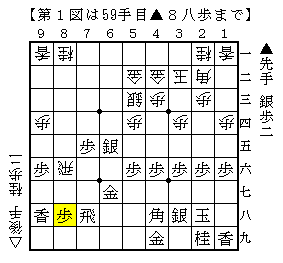  

後手四間飛車相手なら端攻めが入り居飛車優勢という局面だが、  
▲３六歩と▲２六歩の２手多い分相当緩和されている。  
この場合だと他の兼ね合いもあり実際はいい勝負だろうが、  
随所にこのような違いが現れてくるので筆者としては不満である。  

そこで今回は囲いを２手省略、即ち△５三銀と△４二金上を省いた形を考えた。  

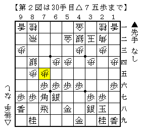  

こうなると居飛車側の形こそ違えど、基本的には後手四間飛車対棒銀と条件は同じだ。  
この場合通常の定跡手順と比較してみると、▲４五歩型は居飛車の得になる変化が多い。  
例えば前回検討した形を考えると、▲５五歩～▲５四歩の取り込みが当たりにならず、  
強く攻め合いに出ることが出来る。  

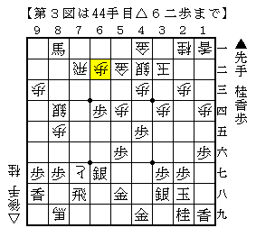  

また準急戦模様から振り飛車が反発する将棋も同様。  
▲６五桂が当たってこないので居飛車が得をしている。  

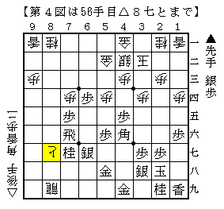  

よって振り飛車側としては▲６七金型で受けて立つのが正しいと思われる。  
例えば下図。  

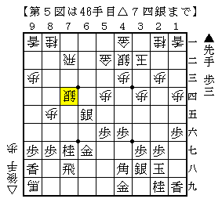  

銀が前線に出ていないのでまるで厚みがなく、５四の歩を取られる懸念もある。  

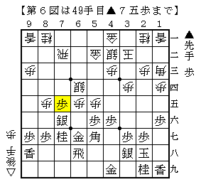  

こちらも厚みがない分損している例。  
これが通るとなると居飛車としてはあまり面白くないと思われる。  

以上のように▲６七金型で応対されると難しいながらも居飛車不満である。  
それでは更に手前で変化して加藤流の銀捨てはどうか。  
他の急戦との兼ね合いもあり、振り飛車側からこの仕掛けを拒否するのは難しいのだ。  
即ち△１二香は角交換された際にはっきりとマイナスであり、  
△１四歩は一手の価値が低く後手三間への急戦が流用できる形となる。  

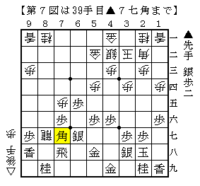  

後手四間飛車相手の際はここから  
△８九龍▲２二角成△同玉▲７七角△３三角▲同角△同銀▲７七角△８七歩▲７五歩  
と進み形勢自体は難解というのが通説だが、これは居飛車不満。歩切れが痛い。  

そこでこの場合は△６六歩としてどうか。以下定跡通り進めると  
▲８八飛△同龍▲同角△６七歩成▲２二角成△同玉▲６七金△６九飛  

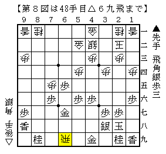  

と進むが、後手四間飛車相手の際は囲いの形が違うため▲７一飛がとてつもなく厳しい。  

ところがこの形だと△５一金引ぐらいで簡単に受かってしまう。  
▲８八角△３三角▲７八銀と飛車を殺すのがこの際の策だが、  
△３九銀▲同玉△４九飛成▲同銀△８八角成と節約した銀を元手に形を乱すことが出来る。  

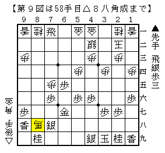  

以下一例は▲６九銀△８九馬▲５八銀左だが、  
△４七桂や△６七馬▲同銀△５七角などの手段がありかなりいい勝負。  
何と言っても自玉がかなり堅いのが心強い。  

更に言えば仕掛けの段階で△１五歩と端を一本入れておく手も考えられる。  
△１八歩▲同香△１九角などといった筋が非常に厳しくなるケースも有り得る。  
こうなるのであれば後手番の割にまずまずどころではなさそうだ。  

上記を総合すると先手三間には棒銀が有効であり  
まさかの「加藤流ネバーダイ」という結論を得ることになるのだが、実はそうはならない。  
筆者が完全に見落としていたポイントが更に手前に隠されていたのだ。  

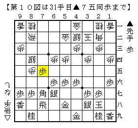  

なんと仕掛けの△７五歩にあっさり▲同歩と取るのが振り飛車の正着。以下  
△７五同銀▲６五歩△７七角成▲同飛△７四歩▲７六歩  

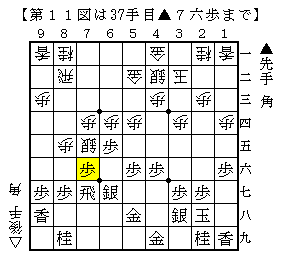  

ここで本当は  
△８六歩▲７五歩△８七歩成▲７六飛△９八と▲７七桂△８九飛成  

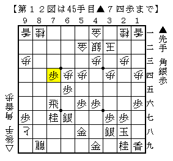  

としたいのだが、これは▲７四歩とされて居飛車が悪そうだ。  
▲４五歩型でないので△４六香と打つスペースがなく、振り飛車玉への早い攻めがない。  
尤も△７二歩と耐えて案外僅差かもしれないが・・・  

また△８六歩に代えて△８四銀とバックするのは▲６四歩と取り込まれて困る。  

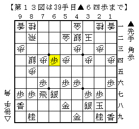  

△６四同銀と出来れば△７三銀右～△８六歩があり居飛車が良いのだが。  

最後のくだりは殆ど藤井先生の受け売りだが、  
総合すると先手三間飛車に対する棒銀はやはり少し無理をしているのでは、  
というのがここ１週間ほど筆者が考えていた事柄である。  
