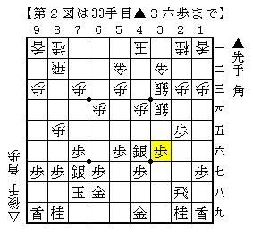
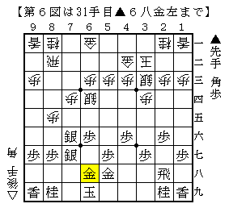

# [角換わり]パラレルワールド  

  

一ヶ月前の筆者がそれぞれの次の一手を言い当てることは不可能だっただろう。  
それほど印象深い序盤の組み立てであった。  

横歩取りの避け方は様々だが、意外とよくやられるのが  
▲７八金△３二金の交換を入れて▲６六歩と矢倉を目指す順。  

  

ある意味で先手が最も欲張った横歩取りの避け方である。  
加藤流なら後手もまずまずだが、脇システムという最終手段が先手に残されている。  

ただしこれは「角換わりになれば△８五歩型は損」という前提の元に成り立っている。  
ところが現在では「歩を伸ばした損」以外に「金の位置が決まった損」という要素も現れ、  
必ずしも▲７八金には△３二金の一手とは言い切れない状況が生まれている。  

  

盤面を１８０度回転させれば最近よく見かける将棋。  
一手損角換わり対早繰り銀の研究が進んだ結果  
３手目▲２五歩まで有力手段になるというのは全く予想していなかった出来事だ。  

図では放っておくと△５六歩▲同歩△７六歩が飛んでくるので先手は仕掛けるしかない。  
△８四飛が入っていないので▲３五歩△同歩▲４五桂が有力だが△３七角と反撃してどうか。  
▲２九飛△３八銀▲３三桂成△同桂▲６九飛△４六角成  
▲３四歩△４五桂▲３三銀△同金▲同歩成△同玉  

  

こう進むと後手玉は裸で怖いものの、４四や４二に逃走ルートがあり簡単には捕まらない格好。  
対する先手玉は次の△５六歩が激痛どころの話でなく、  
▲７九玉と逃げても△５七桂成や△４七銀成、△５四歩など攻める手に困らない。  
あくまで一例だが、これは後手がやれる将棋だと思う。  

そこで一手損となるが▲６八金左～▲７八玉とする手法も考えられる。  

  

▲７八金型だと５筋からの反撃が厳しかったので、それを緩和する意味。  
またしても一手損対早繰り銀でよく見る将棋に合流した。  

  

通常型なら次の▲７二歩を警戒して△５一金とするところだが、  
この場合先後逆という条件を活かして△５二金右と上がる手が成立する。  
即ち▲７二歩なら△７三桂▲７一歩成△８六銀。  

  

最後の一歩を既に７筋で使ってしまったのでこの銀は取れない。  
前例の将棋((71期C2▲伊奈△八代、ただし本文中は先後逆の進行であることに注意))は▲８八銀打から千日手となったが、それでは先手が失敗している。  

このように通常型よりも良い条件で待つことが出来る上に  
▲２四銀△２二銀打など類似の千日手筋が至る所に存在している点も後手が大きく得している。  
今後の一手損角換わり対早繰り銀の動向による部分も大きいが、  
現状では後手が指せる将棋だと筆者は考えている。  

ところで糸谷本では第７図に至るまでに△８六銀と叩き込んでも千日手となっているが、  
「銀損でも難しい」とされているこの局面は本当に後手もやれるのだろうか。  
そうであればより分かりやすく千日手に持ち込めそうだが、  
残念ながら筆者はこの局面にまるで自信が持てないでいる。  

  
