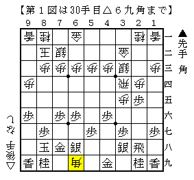
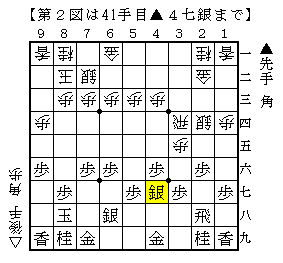
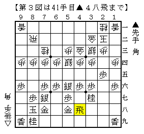
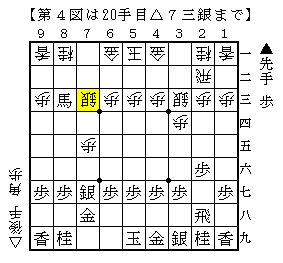
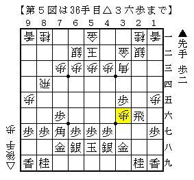
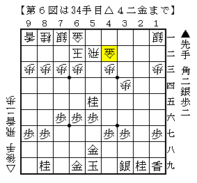
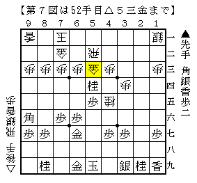
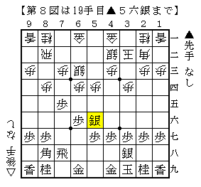
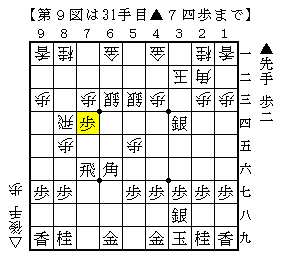

# [将棋生活]シーズン終了  

・某月某日  
地元の大会に参加。  
前日にイベントに参加した関係で完徹での参戦、レッドブルの授ける翼だけが頼りだ。  

-----  

  

NHK杯▲中田宏△橋本をイメージして目一杯欲張った駒組みに。  
△２四歩は▲３八銀で受かると思っていたので「まさか」と思ったが、  
この角を打たれてみてなるほど納得。以下  
▲４一角△２二金▲２四歩△同銀▲７九金△２五角成▲２六歩△１四馬▲同角成△同歩▲４七銀  

  

と土下座して耐え忍んだが、さすがにこれでは勝てるはずもない。  
相手は県でも指折りの強豪の方。さすがの咎め方に脱帽。  

-----  

  

３手目▲２五歩から一手損対腰掛け銀準同型のような形に。  
手損していないのでここでは後手の手番となっている。  

局面自体は後手が得しているようだが、案外ここでの指し手に困った。  
部分的には▲４五歩と仕掛けられたタイミングで△９五歩としたいのだが、  
果たしていきなり後手から仕掛けてしまって良いのかどうかまるで分からない。  
かと言って△４二金引は▲４五歩△同歩▲同桂△４四銀▲３七角のような順が気になる。  
部分的に最善形を保つのであれば△１二香だが、むしろこれは瞬間的にマイナス。  

実戦は迷った挙句に△４二金寄としたが、これも▲２六角ぐらいで自信はなかった。  
この局面に持ち込まないほうがいいのだろうか、未だによく分からない。  

将棋そのものは終盤まで優勢で推移したものの、結局燃料切れで逆転負け。  
いくら前述の強豪氏や友人が来るのが分かっていたとはいえ、この参戦は無謀だった。  

-----  

・某月某日  
この日も地元の大会。  
ただし物凄い賞品が懸かっており、遠方から遥々強豪達が集まってくる。  

-----  

  

筆者が最近試しているのがダイレクト向かい飛車封じの▲７八金。  
それでも振ってきたのでまたもや「まさか」と思ったが、  
昨年の朝日杯で指された佐藤流が飛び出て妙に関心してしまった。  

しかし改めて見ると図で▲７四歩があるか。  
▲７七銀型なので△９五角が王手にならず、７五の歩を回収できる形だ。  
△８二歩▲６一馬△同玉▲７三歩成と実質二枚替えでどうかだが、後手を持ってやる気はしない。  
尤も先手としてもこれが得かは微妙ではあるが。  

なお実戦は残り１５秒vs３０秒から何故か時間が逆転し、  
２秒残して相手の時間が切れるという訳の分からない幕切れであった。  

-----  

  

遂に筆者も△８四飛型に手を出してみた。  
この戦型はどこまで突っ張っていいのか難しく、欲張りさんが指すとすぐに瓦解してしまう印象がある。  

部分的にはどこかで見たような局面図だが、正しくは△２三銀と上がっていないといけなかった。  
この場合だと単純に▲３六同飛と取られ、△１六歩に▲３三角成で取りようがない。  
実戦は相手が見逃してくれたため助かったが、まるで経験値が足りていないことを痛感。  

-----  

  

念願叶って関東のビッグネームとの対局。  
ゴキゲン中飛車に対し▲５八金右を久々に採用した。  
うっかり一撃入る可能性があるのはこれしかない上、負けても相手の研究を知ることが出来る。  
得体の知れない相手なので避けるかと思ったが、堂々と受けて立つのは流石としか言いようがない。  

実戦は例の▲３三香から△１一香で龍を殺す変化に。  
図の△４二金は手番を渡すので、いかにも何かありそうな局面。  

初志貫徹するなら▲６五歩だが、それには△５三金が真っ先に見えた。  
△４二金からの継続手でいかにも味が良い。見れば見るほど良い手に見える。  
「そうか△４二金は４三を受けただけではないのか。もしかして攻めを全て消されている？こんな良い手があったのか！」  

結局長考の末に指したのは▲９六角。頑張って捻り出した一手だが、  
△７二銀▲８二銀△５四香▲８一銀不成△５五香▲同歩△５六香  
▲５四桂△７一玉▲７二銀成△同金▲５七香△同香成▲同金△４五桂▲６七金△５三金  

  

と自然に応じられてはっきり悪くなった。  
途中まだしも▲８一銀不成では▲８一銀成だったかもしれないが、  
やはり▲９六角という香車の代わりのような角が良くなかったようだ。  

しかし感想戦で検討すると、△５三金には▲３一角ぐらいで居飛車が良かったことが判明。  
よって△５四歩（香）ぐらいだが、これは少なくとも一局なる、が結論。  
どうやら勝手に相手の手の味に惚れてしまっていただけだったようだ。  
筆者の悪い癖の一つである。  

-----  

・某月某翌日  
ここ数年参加している団体戦に参加。  
チームの勝ちを目指しつつもやや親善大会的な雰囲気もある、楽しく指せる大会だ。  

-----  

ところが１回戦席についてみると目の前にタイトル経験者×２、そして某府代表常連。  
反則も甚だしいメンバーに目眩がしたが、２日連続でこのレベルの相手と指せる機会もなかなかない。  

  

石田流相手に左穴熊を採用していたが、まるで勝てなかったので今回は二枚銀を採用。  
しかし図で△５三銀と上がったのは危機感を欠いたと言わざるを得ない。  
すかさず▲４五銀と出られて指し手に窮してしまった。  
△８五歩▲７六飛△６五歩▲３四銀△８四飛▲７七角△６六歩▲同角△５五歩▲７四歩  

  

が実戦の進行。  
はっきり言ってこれは投了級で、状況が状況なら本当に投げていたかもしれない。  

改めて図を見ると△５三銀のタイミングで▲４五銀を用意した、非常に周到な駒組みであることが分かる。  
四間飛車において早仕掛けに対し玉頭銀が有力であるのと同様に  
この二枚銀にも玉頭銀が有効であることは以前から分かってはいたのだが、  
ここまで強烈に突っ張った指し方をされるとは夢にも思ってもみなかった。  
修正案としては  
１）△８五歩▲７六飛△５二金右▲２八玉（▲７七角）△７二飛  
２）△５五歩▲４五銀△３三銀▲３六銀△５二金右  
３）△８五歩▲７六飛△７二金  
などが挙げられるが、これは今後の重要課題である。  

なお実戦は一度だけチャンスが訪れたものの、それも掴むことが出来ずまるで勝機無し。  
自陣飛車を打つなどして頑張ったところで実力差は如何ともし難かった。  

-----  

１回戦の後遺症はあまりに重く、  
２回戦　勝勢になりながら「ここさえ触らなければ勝ち」というところをうっかり触って逆転負け。  
３回戦　普通に仕掛けて決戦に出れば圧勝のはずが自重してド作戦負け～圧敗。  
チームが勝ってくれたから良かったものの、これで負けていたらどうなったことか。  

４回戦　ようやく筆者も勝ち。チームも快勝。  
５回戦　勝てば入賞確実の一番、筆者は勝つもチームは負け。  
「折角筆者が勝ったのに僕らが負けて申し訳ない」というチームメイトの弁が深く沁みる。  
