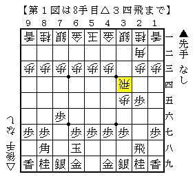
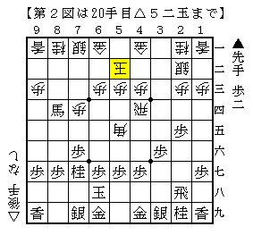
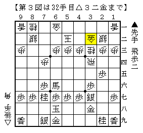
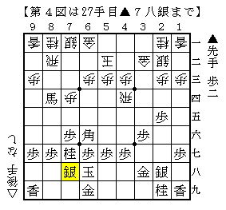
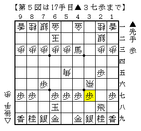
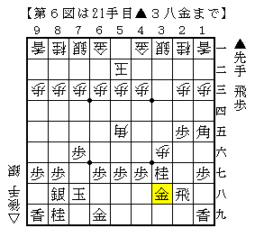

# [後手石田流]筋の応用  

先日筆者の実戦でこのような局面が現れた。  

  

▲６八玉が入っているので一目無理そうな感じがしたが、  
実戦では数分考えた後▲２二角成△同銀▲７八銀と妥協。  
勿論これは振り飛車側の主張が通った形なので、次の実戦でこれを選ぶことは出来ない。  

  

菅井流▲７六飛の定跡通り進めて上図。  
ここで▲３八金という平凡な受けが利くのがこの際の違い。  
通常型なら▲８八銀と受けた形なので飛車の横利きを止めることが出来ないところ。  

▲３八金以下△２八角成▲同銀に  
１）△３四飛▲５五角△８二飛▲同角成△同銀▲３七銀△３三桂  

  

これは▲７八玉、▲７八銀ぐらいで居飛車が良さそうなので  
２）△８二飛▲６六角△３二金▲７八銀  

  

ぐらいでどうか。  
僅かに居飛車が良さそうだが、長引けば大変な感じもする。  

ちなみに我が家のBona先生は▲６六馬と飛車成りを許す順を指摘。  
△８七飛成▲５八玉の時にこれといった手がなく、  
次の▲５五角がどうやっても残るという意味らしい。  
素人にはやり辛く思える順だが、先の順も大したことがないのでこの方がいいのかもしれない。  

-----  

いい機会なので他の形も調べることにした。  
まずは△３六歩▲同歩△６二玉。  
以下▲２二角成△同銀▲６五角△３六飛▲４三角成△５五角▲３七歩と進む。  

  

「菅井ノート先手編」で最善とされた順だが、  
この場合は△４八歩が利かないのではっきり駄目。  
変化の余地もありそうな感じがせず、恐らくこの指し方は成立していない。  

-----  

次に△３六歩▲同歩△５二玉。  
「猪狩守サマに捧げるSyogi Note」で採り上げられている形であり、  
筆者も実戦で遭遇したことがある。  

相振り問題と後手番石田流の試み  
http://blogs.yahoo.co.jp/papaya_papa2000/21455479.html  

正直これは分かりませんでした。  
▲３八飛△２七角▲５六角の展開は▲６八玉がどこまで生きるのかよく分からず。  
▲７八金は△８八角成▲同銀△６四角でやや不満、かと言って▲４八銀とは出来ない。  
菅井ノートにある▲５六歩はこの場合やや居飛車の条件が良さそうだが、  
そもそも作戦として本当に有力なのか図りかねている。  

-----  

最後に△３六歩▲４八銀。これで良ければ前述の作戦を回避できる。  
△８八角成▲同銀△３七歩成▲同銀△同飛成▲同桂に  
△５五角▲１五角△５二玉▲７八玉△３六歩▲３八金  

  

以下「飛歩」「銀桂」の交換となるが、これは難解な戦いか。  
長引けば持ち飛車が生きてくる展開になりそうだが、  
手の付いていない後手陣を攻略するのも簡単ではないと思われる。  

なお３七で精算せずに単に△５五角と打ったり、  
３七で精算して△３六歩としても似たような変化となりそうだ。  
