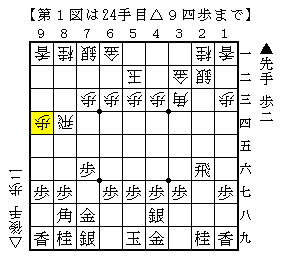
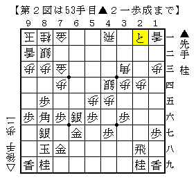
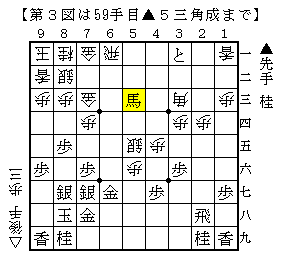
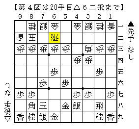

# [将棋生活]ぶらり  

先日少し遠出してきました。  
場所は例によってH山なんとかかんとか。  

-----  

  

最近は▲４八銀に△２三銀しか考えていなかったので逆に焦る。  
もちろんこれも至極普通な一手なのだが。。。  

▲６八玉にはそこで△２三銀が気になった。  
次に飛車をぶつける筋を見ているが、どうそれに備えるべきか分からなかった。  
▲４六歩も飛車ぶつけを見せられると▲５八玉と上がるわけでやりにくい。  

実戦は▲５八玉。無難な手ではあるが、直前の▲４八銀との関連が薄い。  
個人的には△２三銀と決めさせたことに満足して▲５八玉としたいところ。  

どうにもここでは▲３六歩だったかという気がする。  
王将戦▲佐藤康△渡辺やC1▲日浦△小林裕のような展開を目指せばまずまずか。  
△９四歩だと２筋反撃には利かないので、立ち遅れの元にできる可能性がある。  

なおこの将棋はその後作戦の方針が全く定まらず、まるでいいところがありませんでした。  

-----  

  

四間穴に対する銀冠は位取り主体の筆者としては相性の良い作戦だと思うが、  
究極的には振り飛車が勝つ将棋である気もしている。  

図から△５六歩▲３一と△５五銀という進行が考えられるが、実戦は△２一同飛。  
これもあるかとおぼろげに考えたこともあるが、結果的にこれは悪手。  
とてもじゃないが２筋逆襲は間に合わなかった。  

  

感想戦で定跡手順の確認。  
ここで△５七歩成▲同金△６九飛成は▲６八飛とぶつけるのが良いようだ。  
図の▲５三角成というぼんやり成る手がどうにも今までピンとこなかったが、  
こういった展開も見据えていると考えれば立派な手であることが分かる。  

-----  

  

４→３戦法に対して▲６六歩～▲６五歩作戦は弊ブログでも以前採り上げた。  
▲６五歩に△４二銀と受けるので△６二飛からの反発がない、というのがコンセプトの一端だったが、  
△４四歩△９二香型で回られるとは思わなかった。  
角道を止めているので成否は微妙なところだが、居飛車側としても首尾よく位を保つのが難しい。  

実戦は▲９七角▲８八銀型で▲２四歩から▲２二歩を見せて仕掛けたものの、  
全体的に前のめりな感じで上手く行かず。  
昨今の後手石田流の台頭も考えれば、後手升田式に組ませて戦う方策を練るべきなのかもしれない。  

-----  

片道２時間近くかかるので決して効率の良い行き先ではないが、  
今のところ行けば何かしら問題点を提起してくれており、価値はあったと思っている。  
