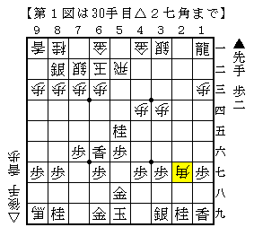
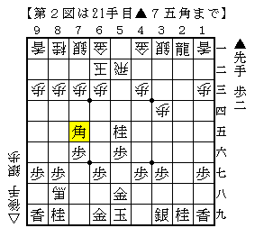
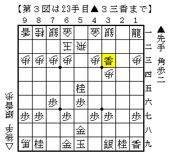
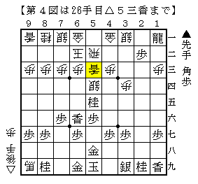
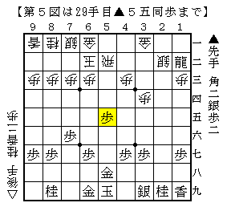
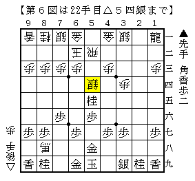
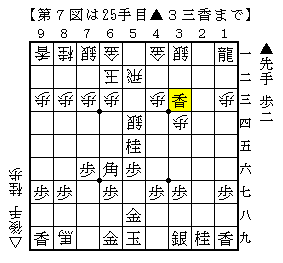

# [中飛車]超急戦の行方（補足）  

補足としているが、正確には筆者による超急戦の雑感である。  

-----  

居飛車側から見て超急戦のスタイルは２つに大別できる。  

１）▲１一龍  
香車の補充～▲６六香とすることで５五の桂を活用する。  
※本稿では王将戦▲羽生△久保をはじめとした例の形を指し、GPS新手等は対象としない  

２）▲７五角  
▲３一角成の２枚替えを見せることで手を作っていく。  

これらの戦いは幾年にも渡る研究合戦がなされたと聞いている。  
（ブランク期とかなり重なっているので、筆者にそこまでリアルタイムの体験が無い）  

-----  

  

旧▲１一龍型における定跡手順中の局面。  
居飛車は桂香で６三の地点に利きを集中させ、  
振り飛車は△２七角と受けに利かせて耐えようとしていることが分かる。  

ここから△７一玉の早逃げと２七の角の利きを最大限に生かし切ることで  
本当に僅かに振り飛車が残しているという結論めいたものが得られた。  

いくら遮二無二攻めればよいとはいえ、やや駒損が過ぎたのでは、  
と居飛車側の立場では言うことが出来ると思う。  

「いくら香の価値が高いとはいえ角香交換はどうなのよ。  
　上手く大駒のリーチの長さで受けられちゃったら元も子もないじゃない。」  

-----  

  

▲７五角と打った局面。ここから  

△３二銀（角筋を避ける）  
▲１一龍（香車の補充）  
△５一金右（▲３三香の筋を受ける）  

と進むが、この３手の意味だけ見ても▲７五角の優秀さが分かるというもので、  
あくまで手番を握り続けて攻める態勢を作っており、  
更に自陣の急所である７五の地点にも利かしているという点で一石三鳥ぐらいの価値がある。  

ただし手順に固めさせた意味も少なからずある。  
更に△７四歩と急所の角をどかせつつ玉を広くする手もあり、  
こちらも僅かに振り飛車が指せると見られているものの、形勢そのものは微差で難解だ。  

-----  

従来の２手法について振り返ってみた。  
非常にざっくりとした内容なので、具体的な内容については定跡書で確認して欲しい。  
では問題の都成新手はこれらと比べてどうなのか。  

  

▲３三香として３一の銀に狙いをつけている点は▲７五角と同じに見える。  
ただし△２二銀打▲３一香成△同金▲１二龍と進めば手番は振り飛車。  
これでは如何にもスピード感に欠けるように見える。  
（ただしそう見えるだけで後の先っぽくなっているのでは、という話もある。この辺りは未解明）  

また仮に銀取りを受けなかった場合▲３一香成～▲４一成香となるが、  
ここで４一に進んだ駒が成香というのが非常に微妙。重い印象が否めない。  
対して▲７五角であれば馬がいることになる。  
▲５二馬と一手で飛車を食いちぎることが出来る上、  
間接的に６三に利いているのでそれを活かした攻め筋もありそうだ。  

こうして見ると、３一の銀を狙うという点においては▲７五角よりも劣っているように見る。  
では旧▲１一龍と比べるとどうか。一つ押さえておきたい順がある。  

  

このように５筋にロケットを構え、△５五銀▲同歩△同香と発射して攻め合い勝ちを目指す。  
▲１一龍の変化における有名な順だが、  
相手の攻め駒を消しながら急所を攻めているので効率が良い。  

これは振り飛車側に銀が残っているので殊更有効になっている。  
旧▲１一龍の変化では▲３三角△４四銀▲同角成と早々に角銀交換しているが、  
このような活用のされ方を消している意味がある。  

都成新手において△２二銀打とさせているのも同様の意味で価値が高い。  
ただし旧▲１一龍と決定的に違うのは銀香交換で居飛車が駒得になっている点。  
旧▲１一龍ではとにかく攻撃力を重視するあまり角を渡して受けに使われてしまったが、  
都成新手の進行では振り飛車側の持ち駒は香・歩と受けに適さない駒しかない。  
対する居飛車側には▲１八角という攻防の手段が残されている。  

「都成新手とは駒をケチる手段だったのだ！」  

-----  

「でもヌルい上にケチるような作戦なら何とかなりそうじゃない？」  

筆者の知る限りプロの公式戦に現れた順は  

・△２二銀打▲３一香成△１一銀  
・△２二銀打▲３一香成△同金▲１二龍△１一香▲同龍△同銀  

の２通りだ。  
ただし筆者はこの２つについては否定的な立場でいる。  
理由は簡単で、後手の１一の銀があまりに酷いからだ。  
遊び駒といっても少しぐらい何らかの役に立つことはあるかもしれないが、  
１一という地点は８１升中最悪と言っていいぐらい働きのない場所ではないかと思う。  

代えて筆者は△２二銀打▲３一香成△同金▲１二龍に  
△５五馬と切り飛ばしてしまう順を考えたことがある。  
旧▲１一龍の変化でも６六の香を馬で食いちぎる順があるぐらいなので  
馬を切ってしまうことにはさほど違和感はなく、むしろ攻め駒を消して好都合ではないか。  

  

ここから歩の裏側を２枚の香車で攻めてどうか、と思ったのだが、  
あっさり中央を放棄して２筋３筋方面に逃げられると桂香香ではまるで捕まえることができない。  
攻め駒をケチった都成新手の意志が通ってしまった感がある。  

またショパン流の△５三香という手もある。  
▲３一香成としても成香ではやや重いので、その間に５筋を食い破っていくというコンセプト。  
手の成否はともかく、前述の順・筆者の指したい手の方向性と一致しているように感じられる。  

中飛車 後手ゴキゲン中飛車 超急戦▲３三香対策  
http://ameblo.jp/shogi-strategy/entry-11592782989.html  

半年前の記事ながら、改めて見ても非常に良い内容だ。  
筆者としてはこの辺りを中心に掘り下げてみたい気がする。  

-----  

最後に近藤流△５四銀について。  
先日のC2▲石田△佐藤和（指し直し）でも現れたので、今後再び現れる可能性はあると思われる。  

  

手としてはそれなりに前からあったが、とても主流とは言えない存在だった。  
△５四銀と打った瞬間まるで反撃できる態勢でなく、  
まるまる一手遅れているような感触の悪さがその理由ではないかと思われる。  
（実際筆者も実戦でこの銀を打つ際非常に躊躇した経験がある。勇気のいる手だ）  

  

ただし前例同様に進め、上図となると都成新手の局面より振り飛車の条件が良さそうに見える。  
振り飛車側は桂を拾えているのに対し、居飛車側は角を手放してしまっている。  
勿論形勢そのものは難解だが、こうなるのであれば振り飛車側に何かありそうな気がする。  

代えて筆者が気になっているのは村山本で触れられていた▲７五角だ。  
△２二飛は銀が品切れなので▲同龍△同銀▲２一飛が厳しい。  
よって二枚替えを受ける△５一飛ぐらいだが▲３三香をどう受けるか。  
先手玉に迫る手段が全くなく、筆者には振り飛車難局に見える。  
