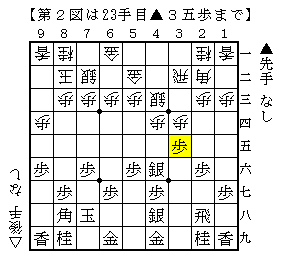

# [棋書]神戸発珍戦法で行こう  

図書館に行ってみたところ発見。  
随分と久し振りに読んでみると、これが案外いい内容でびっくり。  
ガチな棋書全盛時代に突入しており筆者もそれを歓迎する立場ではありますが、  
それに対するアンチテーゼではないものの、こと対照的で伸び伸びとした雰囲気が感じられます。  

現に感銘を受けて既に実戦投入した戦法がいくつかあります。  
実戦投入予定のものも含めいくつか挙げてみましょう。  

・核ミサイル戦法（書籍では「天空の城戦法」）  

  

高田流左玉に似ているものの思想は別物。  
６筋を伸ばす２手を省略している辺りにより攻撃的な感じが漂います。  
組み上がれば模様良く、そうでなくとも割とドロドロとした力戦形になるので  
後手番で３手目▲６六歩に対して使う分には割とイケる感触を得ています。  

なお井上九段の「居飛車奇襲戦法」にも原型と言うべき作戦が載っています。  

・かえるがピョン戦法  

  

三間飛車対する▲２五歩省略の仕掛け。  
四間飛車に対する似たような仕掛けが「四間飛車の急所２」などに載っていますが、  
三間飛車でも似たような理屈がある、といいうことだと理解しました。  

・対三間飛車急戦  

  

ちょっと読んだだけでは「こんな雑な仕掛けで上手くいくのか？」と思いがちですが、  
展開としては「堅い・攻めてる・ウザい」の三拍子揃っているのでまずまずかと思われます。  
後手三間相手にわざわざこれ使うのもどうかという感じもしないでもないものの、  
先手三間に対する急戦として見れば結構有力ではないかという気がしたり。  

・山彦返し  

  

浮き飛車総合戦法「浮雲」の一部ですが、コンセプトは割と優秀じゃないかと思います。  
実戦投入する気満々でいる一方で、なかなか初手▲５六歩とする人と当たらないのがネック。  

こうして見ると、どうにもやや過小評価されている感じがしてなりません。  
斯く言う筆者も弱い頃にはこの本の価値を理解できなかったものですが、  
見向きもしないのはあまりに勿体無い本ではないかと思いました。  
