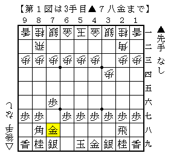
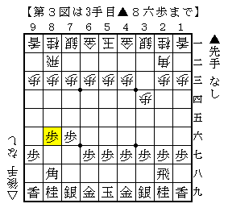
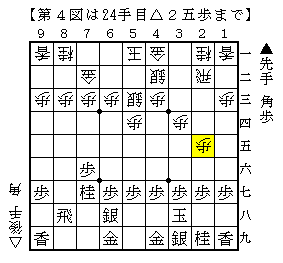
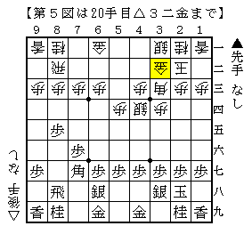
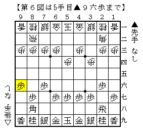
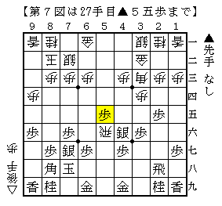
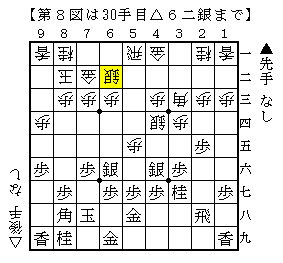

# [その他]最近出会った変わった序盤  

・３手目▲７八金  

  

先日大会に出た際指されました。  
実は以前も同じ方にこれをやられたのですが、△３二金と歩調を合わせてみたところ  
▲６八飛とされて卒倒しそうになったのを覚えています。  
かと言って△４四歩なら右四間＋銀冠穴熊。これはこれで結構ウザい展開。  
よって△４二飛から大人しくしましたが、もっとしっくりくる指し方が無いものでしょうか。  
妙案求ム。  

  

組み上がった図。色々あって手得対持ち角という展開ですが、恐らく作戦負けでしょう。  
指すたびにこういう展開になっているような気がして  
角交換振り飛車はどうにも好きになれないんですよねえ。  

----------  

・３手目▲８六歩  

  

所謂先手角頭歩。  
△８四歩には▲２二角成～▲７七桂、それを嫌って△４四歩には▲７七角～▲８八飛。  
それでも一局ではありますが、色々考えた結果△５四歩が面白いのでは、ということに。  

<del datetime="2014-03-03T01:09:32+09:00">▲２二角成～▲５三角は▲８六歩と突いてある故一応受かる((▲２二角成△同飛▲５三角△６二角▲同角成△同玉に▲２六角の筋が若干気になるが、△５二玉～△４二銀～△５三銀でまあ何とか。これが面倒なら最後△６二同金で。))ので  
▲７七角～▲８八飛ぐらいが相場でしょうか。</del>  

（20140302追記）  
普通に７五に成れました。あまりに酷い錯覚です。  

一応の進行例としては  

  

こんな感じで相振りにするか  

  

こんな感じで左穴熊から振り戻したような展開にするか、というのがありそうです。  
「飛車先を突いていない居飛穴」と言えば聞こえが悪いものですが、  
「左穴熊より２手得」と言われるとなんだかまんざらでもない気がしませんか。  

相振りの図がおかしいだろうという指摘はごもっともで、  
これは前回紹介した「核ミサイル戦法」に多分に影響されているせいです。  
一応△７七角成に▲同桂としか出来ない分銀の活用が難しいという主張があるのですが、  
９筋伸ばされて端攻めが意外と速いということもあり成否は微妙なところ。  
穴熊を指せる方なら後者の方がよろしいかもしれません。  

----------  

・対ゴキゲン中飛車早めの▲９六歩  

  

気楽にゴキゲン中飛車を指してみたところ、早々に端を突かれて意表も突かれました。  
飛車を振る予定なので△９四歩と突き返したいところですが、  

  

こうなるとちょっとどうかなーという感じで  

  

かと言ってこれもなあ。  

余談ですが、先日の王将戦第４局では後々攻められるであろう端をあっさり受けていたので  
「えらく堂々としているなあ」と妙に関心したものです。  
居飛車側としてはこの交換が入る自信がないので▲９六歩と突きにくいと思っていましたが、  
必ずしもそう簡単ではないということなのでしょうか。  

とまあいろいろ考えた結果、実戦は端の突き越しを許す指し方にしてみました。  
結果居飛車銀冠対振り飛車穴熊の持久戦となり、落ち着いた戦いに。  
これなら振り飛車側としては腹の立たない展開と言えそうです。  
