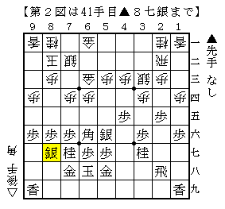

# [プロ棋戦]3/7 A級順位戦  

**昼休現在  
-▲行方△屋敷  
△２四飛の筋は色んな形で模索したが、これだと割と後手の条件が良さそう。  
ただしそれで後手が良くなるかは別というのが厄介。  
個人的には▲６八玉型がまとめにくい感じがするのでやや後手持ち。  

-▲佐藤康△渡辺明  
先日似たような将棋を指したばかりなので気になる所。  

  

図から△５四歩▲７九玉△１三香▲８八玉△１五歩▲２四歩△同歩▲１五歩△１六歩が実戦の進行。  
△１六歩が永瀬本にもあった「永瀬手筋」で、これで形勢が良くなったわけでも何でもないんですが  
ここを拠点に色々とアヤをつけていくことに成功したわけです。  

本譜はちょっと形決め過ぎ感もあってどうなのかなーという感じもありますが、  
先手のこの未完成銀冠が個人的に気に食わない形でもあるのでどっちも持ちたくないですね。  

-▲深浦△谷川  
▲３六歩は４→３を拒否するという意味では価値が高いわけですが、  
△８八角成とされてもよく分からないのでトータルとしての価値には？がつく気が。  
個人的にはあまり選びたくない順ではあります。  

実戦は対して△４四歩という喧嘩殺法というべき対応ですが、  
ここまで頑張らないといけないのであれば水面下の研究は相当のものなんでしょうねえ。。。  

-▲三浦△久保  
▲６五銀と出る方の将棋は何局か振り飛車を持ったことがありますが、  
それは割と振り飛車がやれる感触があったので▲５五銀は不思議でもない感じ。  
しかしこういうのは久保先生が上手く捌いてしまうイメージがあるだけに後手持ち。  

-▲郷田△羽生  
矢倉と角換わりは強い人に任せるに限ります。まるで分かりません。  

そういえばこの▲６七金右は木下新手でしたっけ。  

**夕休現在  
-▲行方△屋敷  
ひと目は先手持ち。城壁と外堀まである状態なので玉の安定度が段違い。  
△７二銀型中住まいは一時期よく指しましたが、金銀の連結が外れると粘りが効きにくいですね。  
非常に当たり前な話ではあるのですが。  

戻ってじっと△６二玉で難解、というのが検討陣の結論でしたが、  
まあ確かにそれで難解なのかもしれませんが、そこまで正解を指してようやく難解かーという。  
後手側がなかなか良くなりにくい造りなんですねえ。  

-▲佐藤康△渡辺明  
この展開で後手持ちたくないという人は少ないかと。  
現実の勝ちに繋げられるかはともかく、局面的には振り飛車成功という気がします。  
少なくとも居飛車側を持ちたくはないですね。  

-▲深浦△谷川  
振り飛車側の金銀があれでは辛い感じがしますね。先手良し。  

-▲三浦△久保  
ここはまだこれからといった将棋。後手持ちだけど先手玉もそれなりに堅い。  

-▲郷田△羽生  
相変わらずまるで分かりません。  
個人的には先手持って攻め切る自信がまるで無いんですが、まあいい勝負なんでしょうね。  
