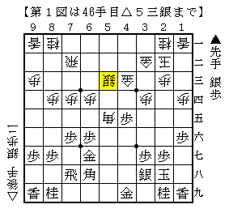
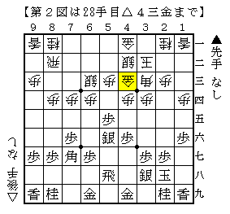

# [プロ棋戦]電王戦の話。  

元々そこまで特別に興味関心のあるイベントではありませんでした。  
普通にプロが指している一局の将棋、言うならば順位戦一斉対局の中の一局と同じような扱いで、  
良い将棋であったり、面白い手が出たりすればまたフォーカスしてみようという感じ。  

ソフトの指した手が何かしら特別かといえば、そんなことないでしょう。  
プロだろうがアマだろうが、人間だろうがソフトだろうが一局の将棋、一手の着手。  
「誰が」を主体にして見ると何かと歪んでくるような気がします。  

筆者が特定の棋士を好きになる場合、その人のこういう手が好きだから、ということが殆ど。  
森内名人、永瀬六段のような厚い受けの手を指せるようになりたいなあ、  
高崎六段のようなキップの良い振り飛車を指せたらなあ、という具合。  
逆に佐藤天七段や斎藤五段のような上品な手は指したくても指せないだろうなあ、というパターンもあります。  

今挙げたのはプロ棋士ばかりでしたが、アマチュアプレイヤーやソフトにも同様のケースが幾つかあります。  
いずれにしても筆者としては「盤上の手→その主体」という意識の向き方があるわけです。  

そんな考え方だからなのか分かりませんが、プロがソフトに負けたところで特段なんとも思いませんでした。  
プロ以外にも強いのがいるわけだから、そっちからも学んでいこうというぐらいのもんです。  
「ソフトに負けるプロに価値はない」なーんて煽られ方が今現在もされていますが、  
これも「ソフトが」「プロが」という「誰が」を主体とした歪な考え方に見えちゃいますね。  
馬鹿馬鹿しいなあ。  

----------  

さて先日の電王戦第一局ですが、最終的な図はともかく内容は力のこもった好局だったと思います。  
特に筆者が感心したのは習甦の「△５三銀」  

  

控室では評判が良くなかったみたいですが（特に先崎先生も否定的だったのが意外）  
「駒は厚く前に進めるもの」という位取りの思想が透けて見えるようで好感を持てます。  
結果的に強大な中央の厚みを築く第一歩となったわけですし。  

振り飛車側はどこが良くなかったのか難しいところですが、  
個人的には▲７八飛が早すぎたんじゃないかという気がしています。  

  

この局面はやや振り飛車の模様が良く、僅かに作戦勝ちだと思います。  
というのも△６三銀の働きが相当悪いから。  
なので並に▲６六歩からこの銀に圧力をかけていく方が方針としては一貫していると思うのです。  
△２四角には▲４七銀～▲３八金・▲５八金で高美濃よりも薄くなりますが、  
相手のマイナスがより鮮明になる方が大きいと筆者は踏んでいます。  

勿論菅井五段もそんなことは百も承知で本譜の順を選んだに決まってるんですがねー。  

----------  

少し前に「第一局落とすようなら人間側まずいんじゃ」みたいな話を友人氏としたものの、  
まあ実際どうなるかは始まってみて終わってみるまで分からないだろう、というのが正直なところ。  
なので二局目以降の展望とかそういうのは特にありません。  

なお第二局のレギュレーションうんたらで界隈が騒がしいですが、  
やねうら氏に軽率な点があったことはともかく、全体として見た際に  
棋士（ソフトとの付き合い方）・開発者（というよりコンピューター将棋全体の技術）・運営・観衆の四者が  
それぞれに未成熟な面があって、それが露呈してるんじゃないかなあ、  
という風にぼんやりと思っている程度で、そこまで関心を持って見ていません。  
程度の差こそあれ、これからそれぞれが成熟していくことでしょうから。  
