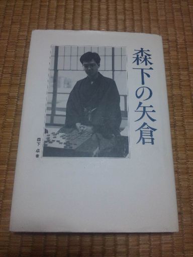

# [将棋生活]森下先生  

今日の王位戦▲森下△佐藤康は凄まじい熱闘。  
中継を食い入るように見つめていた。  

  

電王戦第四局の少し前に古本屋で発見。  
状態まずまず、１３００円というのは悪くない買い物だったと思う。  

相変わらず初手▲２六歩なので先手矢倉は指さない身だが、  
今日から一日一局並べていくことにした。  

（20140517追記）  
１月ちょっとかけてようやく１周並べ終えた。  
発行から約２０年、収録された最も古い棋譜から約３０年経っているが、  
本筋の矢倉実戦集という価値は現在でも極めて高い。  
これからも一日一森下を継続していきたいと思う。  
