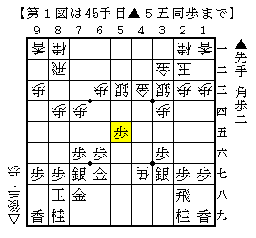
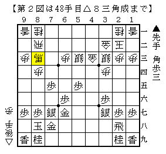
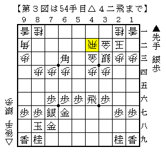

# [矢倉]やってみないと分からない  

全幅の信頼を置く友人氏に「矢倉や角換わりをやってみたらどうか」と提案されたので  
とりあえず後手番で２手目△８四歩とすることから始めてみた。  
もちろん先手振り飛車対策は相変わらず何もない状態だが。。。  

矢倉で試しているのが▲４六銀に△４五歩と突き返す作戦。  
本来の趣旨を鑑みればもっと捻じり合いになるものを選ぶべきだが、  
どうにもやってみようと思える作戦が見当たらなかったので仕方がない。  

さて△５三銀にすぐ▲４六歩と反発する順と一度▲４八飛と力を溜める順に分かれるわけだが、  
前者に対して筆者は漠然と不安な印象を抱いている。  

  

塚田新手△５五歩に▲同歩と取った局面。  
これには△７五歩▲同歩△６四銀でどうかというのがショパン先生の説。  

矢倉　早い△４五歩(塚田流)  
http://ameblo.jp/shogi-strategy/entry-11746476131.html  

んーなるほど。  
▲７四角には△同角成▲同歩△４七角ともう一度打ってしまおうということでしょうか。  

せっかくよく分からない局面が出てきたので、道場の少年にも意見を聞いてみることに。  
今回聞いてみたのは最近成長著しい、勉強熱心な中学生氏。  
「なんとなくこう・・・かなぁ。」と示してくれたのが△７五歩▲同歩にじっと△８三角成。  

  

随分とぼんやりした手だなあと思ったものの、案外先手の指し手も難しいようで  
簡単な検討の結果これはこれでそれなりに「あり」なのではないかということに。  

「でも個人的にはこっちを指してみたいんですよね。」と▲４八飛を示す中学生氏。  
筆者としてはこちらの方が安心感があるのだが、それは単に実戦例があるからだろうか。  

  

一応の課題局面。ここから友人氏を含めた三人でとにかく駒を動かしてみた。  
前例の▲８三銀・▲６五歩はどうにも後手が良さそうということで  
▲７五歩△同歩▲４一銀という順について検討したところ、「激戦」というのがその場での結論。  
後手も割と戦えそうだが先手の手段もありそうで、実戦を重ねてみないとまだまだ分からない。  

なおこの記事を書くにあたってBona先生にお伺いを立てたところ、  
上図で▲７五歩には黙って△５四銀でどうかという少々意外な答えが。  
なるほどそういう考え方もありますか。。。  
