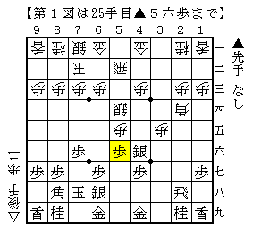
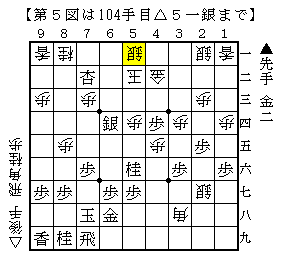

# [将棋生活]気合と直感  

今年は昨年と打って変わって、行ける範囲であればどのような大会でも参加することにしている。  
先日はここ数年非常に相性の良い大会に参加。  

・予選  
相手は道場で知っている同士の高校生氏。  

  

△５四銀型が一手遅いので仕掛けた局面。  
これがあるので▲２四歩を△同角と取りにくく、さりとて△同歩は▲３五銀なので  
仕掛けが入った段階で既に居飛車がやれるものだと１年ほど前から思っていたのだが、  
実戦で指された△４四歩が良い辛抱で簡単でないことが判明。これは今後の検討課題。  

この後お互いに悪手をたくさん指したタイプの指運勝負となり、珍しく敵玉を頓死させて勝ち。  
間違いなく２００手を超えていた熱戦だった。  

・本戦１  
抽選の結果（と言っても最後まで残っていたクジを引いただけだが）損番に。  
最近指したことのある方との再戦。  
その時は横歩取り拒否～急戦矢倉となったので、今回はストレートに相矢倉をぶつけてみた。  

  

[http://d.hatena.ne.jp/urawaza3000/20140411/p1:title=先日の記事]では△６四銀のショパン流でどうか、としていたが、  
コメント欄での検討にあるように△４四銀もそれなりに有力であるようだ。迷った末に今回はこちらを選択。  
以下▲７四角△同角成▲同歩△４七角～△７四角成と馬のできる進行でやや指しやすくなったが、  
この戦型はどこまで行っても激戦なのでねじり合いに次ぐねじり合い。  
結局１８０手弱の熱戦の末これも勝ち。  

・本戦２  
[http://d.hatena.ne.jp/urawaza3000/20140411/p1:title=先日の記事]で登場していただいた中学生氏と。  
最近道場にて横歩で数発入れられており、相矢倉で力を発揮するタイプなので嫌な相手と当たったと思った。  

  

横歩を取らず佐藤流▲５八玉を採用。  
対して通常の相掛かり同様に端を詰めてそこを攻めてきたのがどうだったか。  
（聞けばこの戦型についてあまり知らなかったそうだ）  

実戦はここで▲３三歩と打ててペースを握れたと思った。  
以下△３三同角▲同角成△同金▲３四歩△３二金▲６六角△７五歩▲１一角成と進み、  
そのまま押し切って快勝。  

・本戦３  
相手は元奨有段者の強豪氏。ハードルが高い。  
４手目角交換の一手損角換わりに。  

  

ダイレクト向かい飛車対策の一環で以前指したことのある雀刺しを採用。  
通常であれば▲７八金▲６八玉型だが、本譜はそれよりも得した形になっている。  

ここから△８五歩に早速▲１五歩と仕掛けていったのだが、実は敗着級の暴発。  
△同歩▲同香△１三歩に▲５六銀と上がることができないので仕掛けの形を作れず、  
１筋を逆襲されて手も足も出なくなってしまう。  
実戦も１筋を逆襲されて苦しくなったが、最強の咎め方をされなかったため致命傷には至らなかった。  

  

相手の見落とし・気合とハッタリが通るなど色々ありすぎた後の局面が上図。  
ここでは完全に逆転している。  

実戦は▲６一成香△同玉▲６三銀成という数手前から狙っていた筋を敢行したのだが、  
対する△７二角が見落としていた受けで難しくなった。  
ここでの正解は▲３一金。  
△６三歩には▲５三金で詰み、△６二歩は▲２一金が再び詰めろなので△３三飛と埋めるより無く、  
以下は一手一手であった。  

▲３一金という手は言われてみると納得の手だが、実戦ではなかなか気付きにくい類の手だと思う。  
この周辺について後日検討していた際になかなか明快な勝ちが出ずBona先生にお伺いを立てたところ、  
あっさり指摘されてひっくり返ってしまったものだ。  

  

更に進んで上図。  
▲５八玉とすれば隠居していた飛車がよく利いており詰まず、  
後手玉には▲６二金△同銀▲５二桂成以下の詰めろがかかっているため難しいながらも大逆転だった。  

ところが筆者は▲５九金。最後の最後に来たチャンスボールを逃してしまう。  
以下△４七角成▲５八金打△８三角とされ、最後は２七の銀を活用されて勝負あり。  
戻って図の局面では先に△４七角成としておけば実戦の進行と合流するのでそれまでだった。  

----------  

今大会は気合と直感を全面に押し出したスタイルでまずまずの結果だったが、反省点も多い。  
特に最後の▲６一成香と▲５九金は悔やまれるところであり、  
冷静さ・具体的思考とのバランスを取っていくことが今後不可欠である。  
