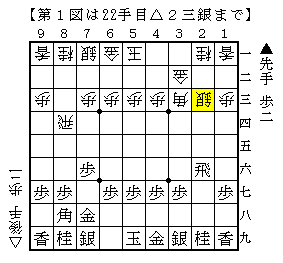
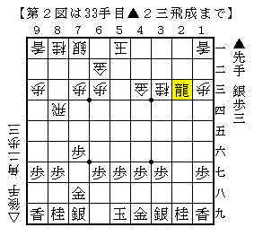
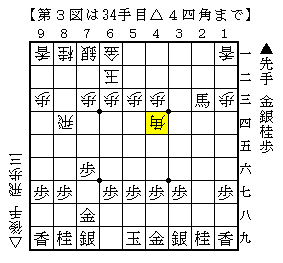

# [横歩取り]成立するなら  

前回記事に掲載した将棋を例の中学生氏をはじめとする中高生数名に見てもらったところ  
正解の手以外にも色々と面白い手を指摘してくれた。  
若者に意見を求めるのも非常に有意義な勉強法だと実感。  

----------  

  

冒頭の件とは別の若者との将棋。  
いきなり△２三銀は▲郷田△菅井でも出てきた新しい手。  
△６二玉の余地を残しているのが大きく、成立するのであれば是非ともやってみたかったのだが  
まさか筆者自身が指すよりも先に相手にやられるとは思わなかった。  

前例はここで▲６八玉だったが、強く咎めに行くのであれば▲２二歩という手段がある。  
これがよく分からなかったので今まで採用しなかったという経緯があった故、少考で踏み込んでみた。  

以下は進行例。△２二同金▲３三角成△同桂▲３一角までは進むところで、  
１）△３二金▲５三角成△６二金▲４三馬△同金▲２三飛成  

  

２）△４四角▲２二角成△２六角▲３三馬△６二玉▲２三馬△４四角  

  

前者は前述の▲郷田△菅井の感想戦で出たとされる順。  
先手もまあまあな気もするが、▲２一龍には△４一歩が利くので案外粘れるか。  
また手順中後手から変化する場所もありそうで何とも言えない。  

そして後者のように駒を取り合っても意外と大変な気がする。  
先手が駒得で馬も作っているが、△６二玉とこちらサイドに逃げられるとどうか。  
次に△２八歩▲同銀△２五飛の狙いがある。  

実戦は▲３三角成に△同金としてしまったため▲６六角で急に後手が忙しくなった。  
以下△２四飛▲３三角成△同桂▲２四飛△同銀▲２一飛となり一方的に攻めて勝ち。  
聞けば早い△２三銀は作戦ではなく単純なミスだったとか。  
とはいえ一度やってみたかった形になったわけなので、個人的には勉強になった一局。  

----------  

ちなみにいきなり△２三銀以外にも△８八角成～△３三桂～△２五歩を先に決める指し方もあるようだ。  
twitter:454129083152990208:detail  
twitter:454129751024599040:detail  
twitter:454131060133986304:detail  
twitter:454131848247906304:detail  
twitter:454153566073020416:detail  
twitter:454163217158127616:detail  
twitter:454166694185816064:detail  
尤もここまでやってもリスクとリターンが釣り合っていない気もしなくもない。  
