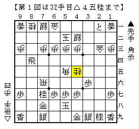
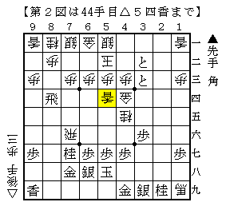
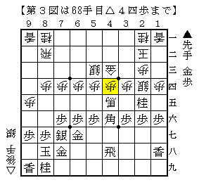
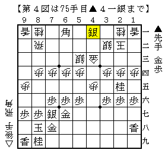

# [将棋生活]お勉強の時間。  

四日市まで行ってまいりました。もちろんレーティング選手権の観戦が目的。  
知人の応援が目的だが、同時にこの上ない良い勉強機会となる。  
なにせ[http://userimg.teacup.com/userimg/8260.teacup.com/seikikai2/img/bbs/0000267.jpg:title=これだけ]の凄いメンバーなのだから。。。  

----------  

中学生強豪N氏と元奨三段S氏の将棋は筆者に限らず全居飛車党注目の戦型に。  

  

前例の▲丸山△屋敷は▲８一飛成だったが本譜は▲６八銀。  
△８二歩▲２四歩△３三金▲２二と△１九角成▲２三歩成△４四金▲３二と△５一銀▲３三と△５四香  

  

はっきりとした記憶があるのがここまで。次の手は▲４八銀だったか▲４二と上だったか・・・  
いずれにせよ数手後に指された▲４二と上が厳しく先手が指せるようだ。以下先手勝ち。  
感想戦では深入りしなかったため詳細は不明だが、この戦いもかなり紙一重なので後手側も勇気が要る。  

----------  

ねりもので知られる強豪S氏は相矢倉での新研究を披露していた。  

  

ここから▲６五歩が一般的な定跡手順だが、  
▲２四角△同歩▲４五飛△同歩▲６一角△３二銀▲４一銀という物凄い強襲が実戦の順。  

  

実戦はここで△２五歩だったため▲３二銀成△同玉▲２三金△同玉▲４三角成で潰れてしまった。  
代えて△４二銀から耐えてどうか、というのが感想戦で指摘された順。  
筆者もそれで耐えているのではないかと思ったが、かなり鬱陶しく絡まれ続ける展開なので受け切るのも大変だ。  

戻って▲４四歩には△４五馬ではなく△同金の戦いを選ぶべきだというのが筆者の持論。  
尤も△４五歩の将棋しか選ばないので筆者はこの将棋を指さないのだが。  

----------  

他にも元奨三段対決となったA氏対M氏戦で現れた才気爆発の寄せをはじめ、勉強になった将棋がいくつもあった。  
後にアマレンから棋譜集が出るので是非ともお買い求めいただきたい。  

一方の知人氏は戦前から予想された通り苦戦続き。粘り強く指す棋風だがなかなか勝ちに結びつかない。  
しかし感想戦で最終盤に勝負できる筋を指摘されることが少なからずあり、  
「終盤力が足りない」と嘆く知人氏に対し、筆者は「手はあるものだ」と感心することしきり。  
最後まで一撃を狙い続けることはある意味では当たり前のことではあるが、  
その重要性を実感したことが今回最も勉強になったことであるように思われる。  

それにしても大会日程の半分で帰路に就かざるを得なかったのが残念でならない。  
来年は選手として四日市に行きたいものだ。  
