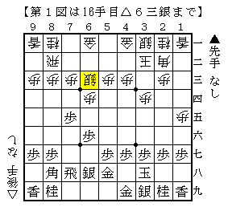
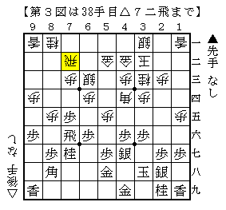
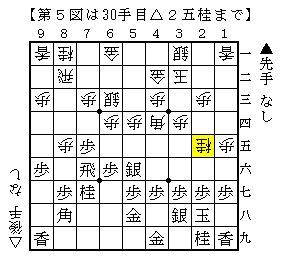
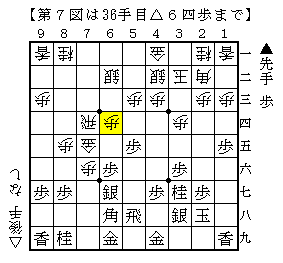
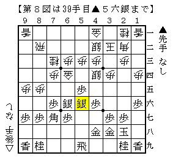
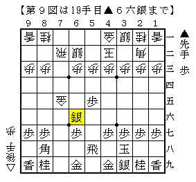

# [その他]二大先手現代振り飛車対策  

どちらもプロ公式戦で指されたことがあります。  
筆者の知る限りでは共に公式戦勝率１０割を誇る素晴らしい作戦です。  

**石田流対策編  
  

４手目△１四歩から端の位を取るのがこの作戦の第一歩。  
▲１六歩なら△４四角型の相振りに。これが割と優秀で、筆者はそこそこ稼げています。  
△１五歩に▲４八玉なら角交換～△４五角で早くも居飛車有利。割と現れやすい筋。  

  

△４四角～△３三桂型に決めてしまうのがこの作戦の肝。  
端に狙いを定めて美濃囲いを牽制しているわけです。  
なお筆者は知人が△５四銀△６三金△４二銀型を指しているのを見たことがあります。  
この辺りの駒の配置の組み合わせはいくらか考えられるところ。  

▲４五歩と好位置の角追い払おうとしても△５三角や△６二角とラインをキープ。  

  

１号局は端攻めを喰らってはかなわんと▲２八銀と受けたので、  
△７二飛～△９二飛の揺さぶりが厳しく入りました。  
結局居飛車側から飛車をぶつけて飛車交換に持ち込む展開になり快勝。  

  

２号局は振り飛車が矢倉に組み替えた将棋。  
対して居飛車は一旦銀冠にしておいてから△７二飛の筋で打開。  
△２五桂が利く形なので振り飛車玉に手が付きやすく、端攻めが入ったところで投了。  
端攻めが切り札になる作戦なのです。  

  

嘘っぽい筋もついでに紹介。  
何も考えず美濃囲いに組んできた場合はいきなり△２五桂の飛び蹴りがあります。  
端で桂香総交換となれば△８四桂で飛車がトン死。これも何度か食らわしたことがあります。  
ただこれ一本で狙いすぎると相手に警戒された際にド作戦負けに。  
切り札はここぞという時に出してこそ。  

（20160305追記）  
居飛車側を持った村田智弘先生が石田流破りの棋書を執筆なさったので、是非とも皆さん買いましょう。  

**先手中飛車対策編  
  

初手▲５六歩と我が道を行く手に対して、△７二金と更にその上を行くのがこの作戦の骨子。  
対ノーマル中飛車でも△５三金戦法があったように、中飛車には金を用いた急戦も有力なようで。  

△７二金を見て▲７六歩～▲７八飛が賢い振り飛車党の指し方ですが、右玉にしておけば一局。  
むしろ慣れていない作戦を強要している感すらあります。何でも指せる人なら初手▲７六歩でしょう。  

  

まずは１号局から。こちらも△７二飛から使っていきます。  
７筋を制圧してこの後桂も使える形。まあいい勝負といったところでしょうか。  
１筋の関係は難しいところで、全体的に手が遅れがちになる故に譲っておくのも一理あるところ。  
実戦はこの後捻じり合いがあった末に居飛車の人が強くて勝った印象。  

  

ここからは筆者の実戦を元に。  
筆者の１号局は銀対抗形のように△４四銀と繰り出してみましたが、  
６二の銀を更に２手かけて囲いにひっつけているため手数がかかりすぎ。  
△５二飛～△５四歩と動いてみたものの上手くいかず。勝ったものの作戦は失敗。  

  

「そもそも８筋を伸ばしてもあまり価値がないのでは？」  
という素朴な疑問が生じたため、２号局は７筋の動きを優先させてみました。  

図は早くもやってきたホームランボールの局面。  
一旦△７六金とすれ違い、▲７八金とさせて△６六金と銀を取るのが狙いの順。  
実戦はここで投了。ネット将棋とはいえ上手く行きすぎました。  

なおこの筋は駒組み後でも有効で、△６六金～△７八（７九）飛成となったことも数度あり。  
金の特性を活かした狙い筋ですが、金銀交換なので飛車が成れても思った以上に微差なのでご注意を。  

**免責事項  
２手目△８四歩に傾倒している都合上、  
現在筆者はこれらの作戦を指していないことを最後に付け加えさせて頂きます。  
