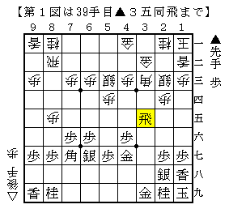
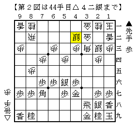
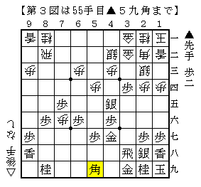
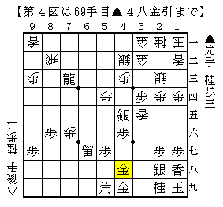

# [四間穴]K/U/M/I/A/W/A/S/E ６  

届いたばかりの将棋世界誌を読んでいると、竹内元三段を取材した記事があった。  
自分で考えるということを止めてしまい、いつしかはっきり弱くなってしまった、が本人の弁とか。  

実はこれ、程度の差こそあれ筆者も最近危惧していること。  
対局の前・最中・後と全てにおいて脳がかいた汗の量が減っている実感がある。  
いくら弱いと言ってもプレイヤーとして将棋をしている以上、  
しっかり考えしっかり読んで指し手を進めたいものである。  

----------  

さてプロの実戦例や書籍で紹介された内容に毛が生えた程度の内容の「名ばかり研究」ばかりの筆者だが、  
この度珍しく少し太めの毛が生えたので、折角だし記しておきたいと思う。  

  

先手四間飛車穴熊に対する銀冠穴熊。  
筆者は従来ノーマル銀冠で対抗していたが、やはり先手四間穴相手には厳しい物がある。  

さて「急所２」ではここで△８六歩と△３四歩が解説されているのだが  
前者は離れ駒がある状態で動いていくこと自体が無理気味であるし、  
後者はわざわざ歩を打ったのに直後にそれが狙われており、どちらも作戦的に疑問符がつくと言わざるを得ない。  
ということで△３一金寄を模索したい。  

  

数手進んで上図。この△４二銀が作戦の骨子。  
こうして見てみると、居飛車側の駒組みが対ゴキゲン中飛車一直線穴熊のそれに似ていないだろうか。  
つまり▲３四歩には常に△２二角とこちらに引く余地を残しておき、  
▲４五銀なら△８六歩▲同歩△７五歩と勝負しようということ。  

「急所２」で解説されていた手順ではことごとく角頭を持ち駒の銀で攻めていたが、  
あんなところに銀を注ぎ込みたくないというのが筆者の第一感。  

  

筆者の実戦譜より。ネットでは既に数局試しているが、まともな将棋はまだ１局のみ。  
▲９八香にどうするか難しいところだが本譜は△１四歩。  
△２二金上もなくはないかもしれないところで少し調べたがよく分からず。本稿では割愛させていただく。  

筆者は図の局面を迎え「ここは何か一手相手に指してもらい、そこで△６六角とするべき」と考えたのだが、  
実戦で指した△２五歩は▲３六銀△３四銀▲３五歩△２三銀▲２五銀と進んで良くなかった。  
とは言え△１五歩のような手は▲７四歩で大体損をしているので△８四飛ということになるが、  
これには▲５六金が異筋の好手で居飛車が困ることが判明。  
よってどうやらこの局面では適当な手渡しがなく、△６六角と決戦に出るしかないようだ。  

  

△６六角以下の進行例。  
△３五香が入るので居飛車もやれそうだが、振り飛車側もギリギリ踏ん張っている格好。  
正確に指せば居飛車もやれそうだが、形勢そのものはまだまだ難解かと思われる。  
