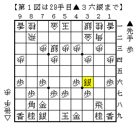
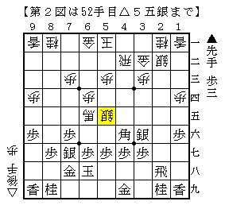
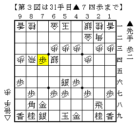
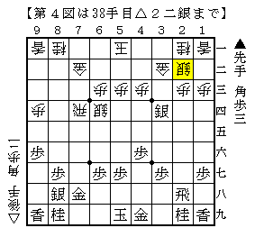
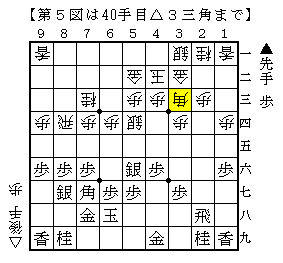

# [相掛かり]KG  

相掛かり腰掛け銀。色々あったが筆者の先手相掛かりはここに落ち着きつつある。  
引き飛車棒銀は突っ張っているとあっという間に空中分解するので扱いきれず。  

----------  

  

今更ながら名人戦のアレ。  
▲２五銀を防ぐだけなら△８八角成～△３三桂だが、  
前例の▲１五歩△同歩▲２一角が第一感の攻めでやはり後手が嫌な形。  

その筋を消すのであれば△４二玉を入れておく必要がある。  
筆者は先日△６三銀に代えて△４二玉とする将棋を試みたものの、桂頭の負担気になる将棋となった。  
やはり実戦の△５四銀▲２五銀△８八角成という進行が妥当なところか。  

  

感想戦の順。歩損が気になるものの、後手としては悪くない感じ。  

「ふむふむ、この将棋は△４四歩～△２四歩～△３三歩狙いでいくのが良いのか。」  
などと思っていたところ、たまたま北海道将棋連盟道場日誌で[http://www.sho-gi.net/dousyourenn-nikki08-30.htm:title=こんな記事]を発見して唖然。  
凄い前例があったものですな。  

----------  

  

対早繰り銀。  
この▲７四歩はC2▲田中魁△藤森が元ネタ。  
先後逆なので△５二玉が入っておらず、▲４三銀成△同金▲３二角といった筋がある得だと判断。  

  

数手後の局面。実戦はここから▲７七銀△５二玉▲５六角と決めに行ったが、  
△７五飛が唯一の凌ぎで、これでぴったり受かっている。  
感想戦で▲７七銀△５二玉を入れずに▲５六角も検討したがどうにも芳しくなく、  
▲５六角と打つ筋自体がどうにもやや無理っぽいような感じがする。  

ということで図の局面では▲４三銀成を敢行するしかなさそうだが、  
４筋の歩が切れるため△４八歩といった筋もかなり厳しい。一応の検討課題。  
ただ最近、▲４六歩と突いているのに動くのはあまり上手くいかないのではという気がしている。  

----------  

  

昨日指した将棋。この△３三角はチャンスボールだと思い長考。  
「よくわかる相掛かり」にも載っていた▲３三同角成△同桂▲３六歩が第一感だが、  
そこで△４四歩でよく分からなかった。以下▲３五歩△４三銀▲３四歩△同銀▲３五歩△４三銀。  
まあ銀を引かせて桂頭に不安を抱えさせているから不満ではないか。  

なお実戦は端を絡めた明らかに暴発の仕掛けをやってあっさり悪くなった。  
それほどひどい悪路ではないものの、足腰が弱くすぐにコケてしまう。  

（20140615追記）  
なんと翌日に同じ相手と全く同じ局面の将棋になった！  
上記の順をやってみたところ、思った以上に後手が困っているようだ。  
