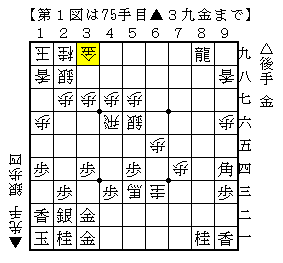
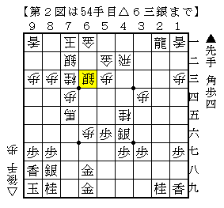
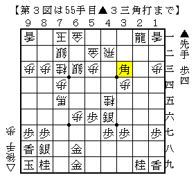
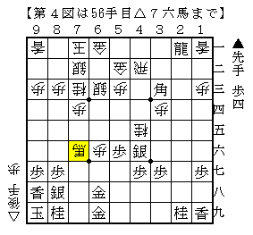
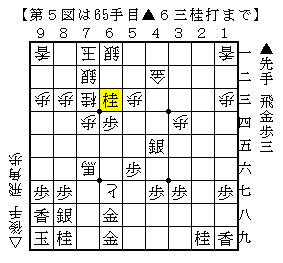
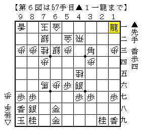
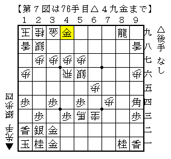

# [穴熊日記]基本のキ  

ウォーズ弾丸より。0.5秒でお答えください。  

  

----------  

久々に四間飛車に居飛穴。振り飛車側の作戦がまずく、早い段階から良くなった。  
ただ、  

  

ここで  

  

こうして  

  

これを食ったのはさすがにまずかった。  

問題はその後。  
やってしまったものは仕方ないとして、こういう時はどうすべきか。  
▲６一龍△同銀▲４二角成△同金▲６四歩△７二銀引▲４五銀△６七歩成▲６三桂  

  

と絡んだのが実戦の順。  
仕方なく突っ込んでいった感じで、大体こういう時は切れてしまうもの。  
実際△６二玉▲２二飛に△４一歩ならかなり難しかった。  

それでは、とBona先生に見解を伺ったところ▲１一龍という回答が。  

  

「貯金が大きいんだからここは我慢しとこうよ。▲６八香もあることだし。」  
という理屈は納得だが、△２一歩や△４一歩と何重にも止められる筋が見えているので  
厳密には正解であったとしても実戦的にはなかなか指しにくい。  

もっともこういう手を指せる人が強いんだろうなあ。。。  

----------  

さて冒頭の局面。もちろん正解は△４九金。  

  

新井田さんの言葉を借りれば  
「ゼロ秒で指がここに行かなければ、まだやっている将棋が穴熊ではないということ。」  

局後に検討やっても辿り着けないんだからまだまだですなー。  

（20150711追記）  
１年後に改めて見てみた。  

・・・相変わらず△３九龍を読んでいた。  

（20160811追記）  
２年後に改めて見てみた。  

△４九角成。僅かに進歩している・・・のか？  
