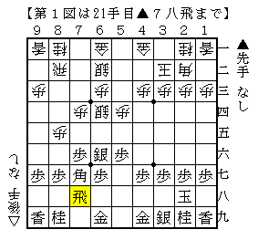
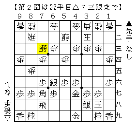

# [将棋生活]Bigになれよ。  

ほんの数分前に「ここを凌げば勝ち」と意識したにも関わらず、  
手堅く受ける第一感の手を指さずに敵陣に目が行ってしまったのは何故なのだろうか。  
要はそれが弱いということだが。。。  

笑顔でいられるのは勝者だけで、それ以外は皆「弱い、弱い」と嘆きながら去っていく。  

----------  

先手中飛車に鳥刺し。  
あまり良い作戦とは思えないのだが、他がうまく行かなくなってきたことで相対的に価値が向上。  

  

普通の受け方だが、何故か今までやられたことがなかった。  
仕掛け方に困った挙句ひねり出したのがこれ。  

  

「神戸発　珍戦法で行こう」の思想が生きている。  
その場の思いつきの割にはまずまずの構想だったようだ。  
