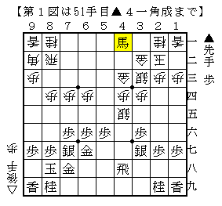
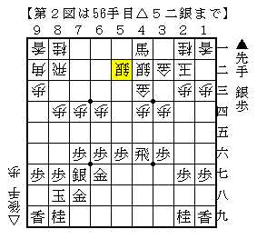
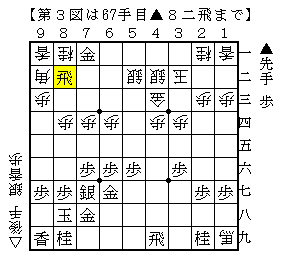
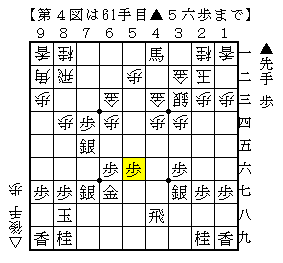
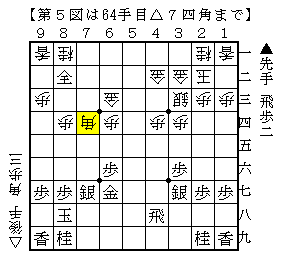
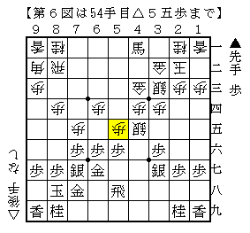

# [矢倉]土曜日の実験室  

最近並べているのが中田宏樹先生の「対矢倉　左美濃作戦」。  
難易度の高い内容だが、これぞ筋という順しか載っていないので勉強になる。  

矢倉曼荼羅｜エトワールのささやき  
http://ameblo.jp/etowa-ru/entry-11206802827.html  

とりあえず「薬師の図」についてはこの本で深めることが出来るかと。  

----------  

  

例の将棋の▲４八飛コースより。  
▲４六銀がプロの実戦例の順だが、筆者の対局ではこれが多い。  

例によってまずは[http://ameblo.jp/shogi-strategy/entry-11746476131.html:title=ショパン流の手]から拝借ということで、ここで△４二銀と指してきた。  
確かにこれで馬を捕まえることが出来る形だが、  
▲４六銀△同銀▲同飛△５二銀  

  

▲３二馬△同玉▲７一銀△７二飛▲６二金△７一飛▲同金△２八角▲４九飛△１九角成▲８二飛  

  

こう進んでみると△５八銀があるとはいえ後手難局ではないかと思う。  
そっぽのはずの７一の金がこの後８一～９一と桂香を拾っていくことで  
そのまま角まで召し取られてしまう格好だ。  
△５一歩でそれなりに耐えられる形をしているが、桂香で攻められると早い。  

戻って最初の図の局面では△７五歩と角を働かせる方が優るのではないかと思う。  
ただこの局面は手が広いところで、少しBona先生と検討しただけでも  

１）▲同歩△５六銀▲７四歩△６七銀成▲同金△５二歩▲７五銀△６三金▲５六歩  

  

２）（上記△５二歩に替えて）△４二金打▲６三馬△５三金寄▲７三銀△６三馬▲８二銀成△７四角  

  

３）▲５八飛△５五歩（もしくは△５六銀▲同金△５五歩）  

  

と複数の有力そうな順が現れるなど、すぐに方針が固まるとは思えない展開に突入する。  
筆者の２手目△８四歩の中核をなす戦型だけに、今後検討を重ねていきたいところだ。  

ところで今月号の将棋世界で△４五歩が取り上げられていたのにはびっくり。  
本家は単に△４四銀右ですか。うーむ。  
