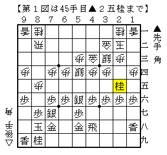
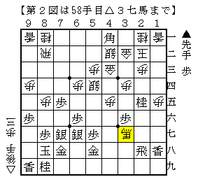
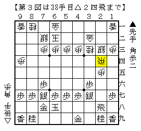
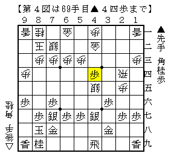
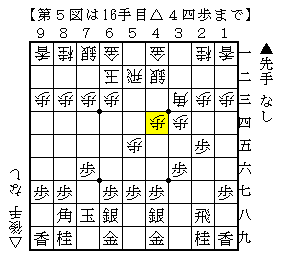
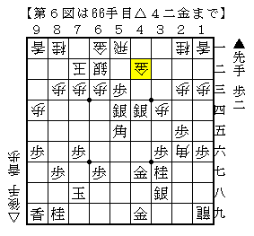

# [将棋生活]開けゴマ  

先日指した将棋より。  

----------  

  

角換わり腰掛け銀△４二金型に▲１八香。  
そもそも後手角換わりは全くと言っていいほど勝てていない戦型の一つだが、  
四間飛車を指していた時と比べるとそこまで苦になっている感じがしない。  

▲１八香△４三金直▲２五歩△４二金引▲４五歩△同歩▲同桂△４四銀▲３七角  
がよく指される順で、これなら割と後手も戦えるのではと思っていたが実戦は△４三金直に▲２五桂。  
一目何とかなる仕掛けだが予備知識が全くない。長考に沈む。  

  

結局この仕掛けはやはり微妙だったようで、  
最終的に図から▲２九飛△３八馬▲２六飛△３七馬で千日手となった。  

珍しく後手角換わりで上手くいき喜んだのも束の間、  
指し直し局では時間切迫からウソ矢倉相手にド作戦負けに陥るという情けない展開に。  
自分から勝ちに行く将棋でない上に時間配分も気にかけなければならないというのは結構ハード。  

----------  

  

横歩取り△８四飛△５二玉型に▲６八玉。  
単に▲６八玉と上がる形は正直あまり大したことがないと思っていたのだが、  
ここに来て筆者好みの指し方が発見されたことで印象がすっかり変わってしまった。  

図の局面は次に△４五桂があるので何かしら対処するところ。  
実戦は大人しく▲２七歩としておいたのだが善悪は微妙。  
類型の72期C1▲日浦△小林裕と比べると後手玉の堅さがまるで違う。  
しかし単に▲４六歩も考えたが、ちょっとやり切れなかった。  

  

局面が進み上図。  
無事▲４七銀型に組み替えることができたので先手がまずまずの態勢になっている。  
この▲４四歩がふわっとした手渡しで、我ながらなかなかの手だと思った。  
対して△２六歩だったので▲同歩△同飛▲９五歩△同歩▲７四桂△同歩▲３七角の王手飛車が実現。  
しかし△５四銀でも同様の筋があり、後手に有効な指し手があまりない状況だ。  
戻って後手としては▲４七銀型に組み替えている間に仕掛けてしまうべきだった。  

しかしこの将棋もこの後上手く粘られてしまい、最後に筆者の決め方がまずく逆転してしまう。  
こういう将棋を難なく勝ち切れれば筆者ももっと上位クラスに居ようものなのだが。。。  

----------  

  

ゴキゲン中飛車にノーマル▲３七銀急戦。  
相掛かり腰掛け銀や２手目△８四歩を指し始めたことで全体的にじっくりとした戦型が多くなり、  
その影響か最近は▲７八金型に回帰しつつある。  
ただやはり格上に一撃入れやすいのは超急戦かこれ。  

図は最序盤で早速振り飛車側が工夫を見せてきた局面。  
▲３七銀に△７二玉なら▲３五歩～▲２四歩～▲４六銀で指せそうだが、△４三銀とされてどうか。  
▲４六銀は△４五歩なので▲３五歩～▲４六銀が考えられるが、攻め切れるかどうかは難しい。  
本譜は▲７七銀として異なる展開の将棋となった。  

  

終盤戦となって上図。  
中盤早々に悪くしてしまい、以下淡々と粘った結果こんな局面になってしまった。  
ここで▲４五桂が「指されていたらパニックになっていた」一手。  
冷静に５三の地点を押さえてしまえば居飛車側に楽しみの多い展開。  
実戦は強く▲４三歩と打ったが、△５三金▲４二歩成△５四金とされてアテが外れた。  
冷静さを保つ事ができなかったのが残念な一局。  

（20140721追記）  
公開してから気付きましたが図面が間違っておりました。  
△１九龍ではなく△１八龍ですね、これだとさすがに筆者でも桂跳ねます。  
