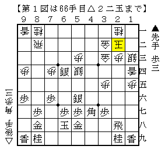
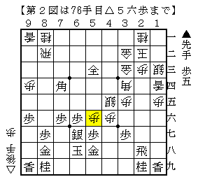
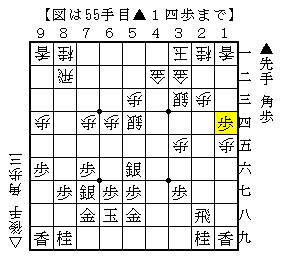
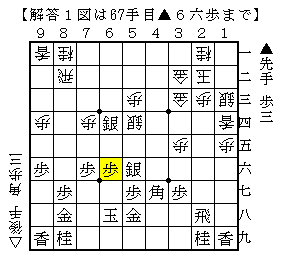
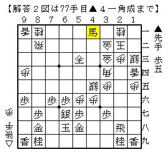

# [相掛かり]セントルイスに家が建つ  

解答忘れをやってしまったので代わりに出題。  

１）  
  

筆者が指した手。  
「ふわっと。」  

２）  
  

筆者が指せなかった手。  
「じわっと。」  

=====  
----------  

筆者の通う道場の師範との将棋より出題。  

  

ここから  
△２四銀▲６六銀△１四香▲４七角△１三銀▲５五銀左△３三金右▲６四銀△８八歩▲同金△２二玉  
と進んだのが問題１図の局面。  

筆者が指したのは▲６六歩。  

  

△４四角の筋を消しつつ▲６七銀と引く余地を作ってまずまずの味。  
代えて▲７八玉もあるところで比較は難しいが、こちらの方がより含みがあるかと思う。  

----------  

△３四角▲５三銀成△４六歩▲３八角△５五歩▲６七銀△４五銀▲７四角△５六歩  
と更に進んだのが問題２図の局面。  

対して素直に▲５六同歩が実戦の進行で、そこで当然△８四飛が飛んでくる。  
▲７五歩△７四飛と飛車を切られて凌ぎ切るのが難しい展開に。  

ここでの正着は▲４一角成。  

  

△５七歩成▲同金△５六歩▲５八金の展開はそれ以上の厳しい攻めがなく先手有利。  
かと言って他に速い攻めがあるわけでもなく、先手がやや有望な展開だったようだ。  

これを逃してからというもの延々と逃亡生活を続けることとなり、  
ゲームがゲームならトライ勝ちというところまで行ったものの最後は御用。  
遷都とはならず。  
